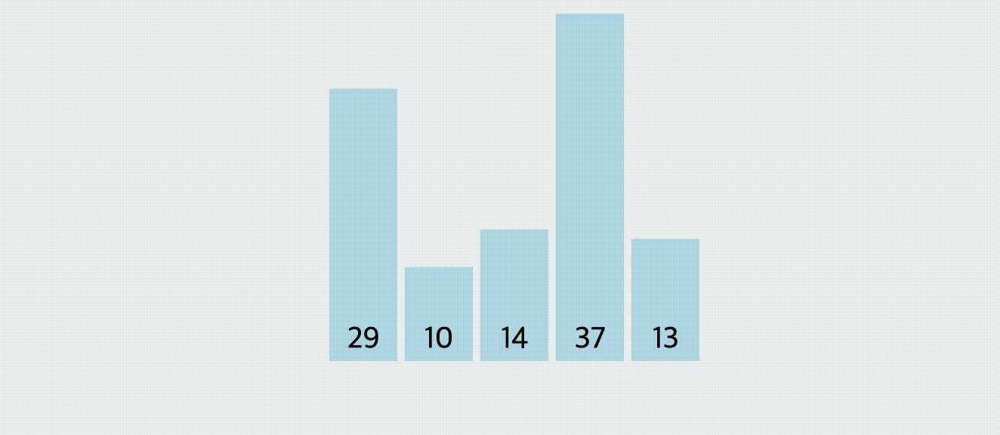
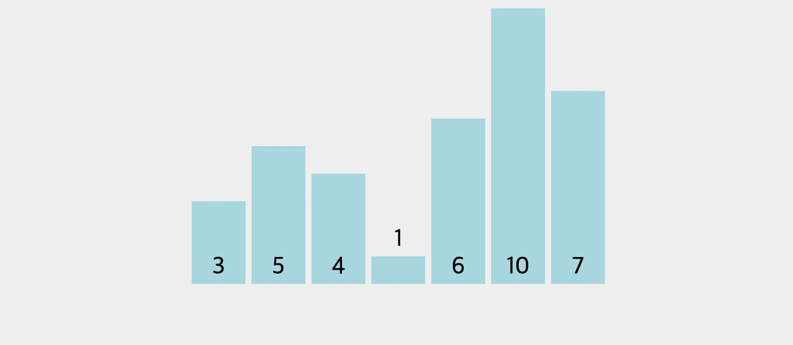
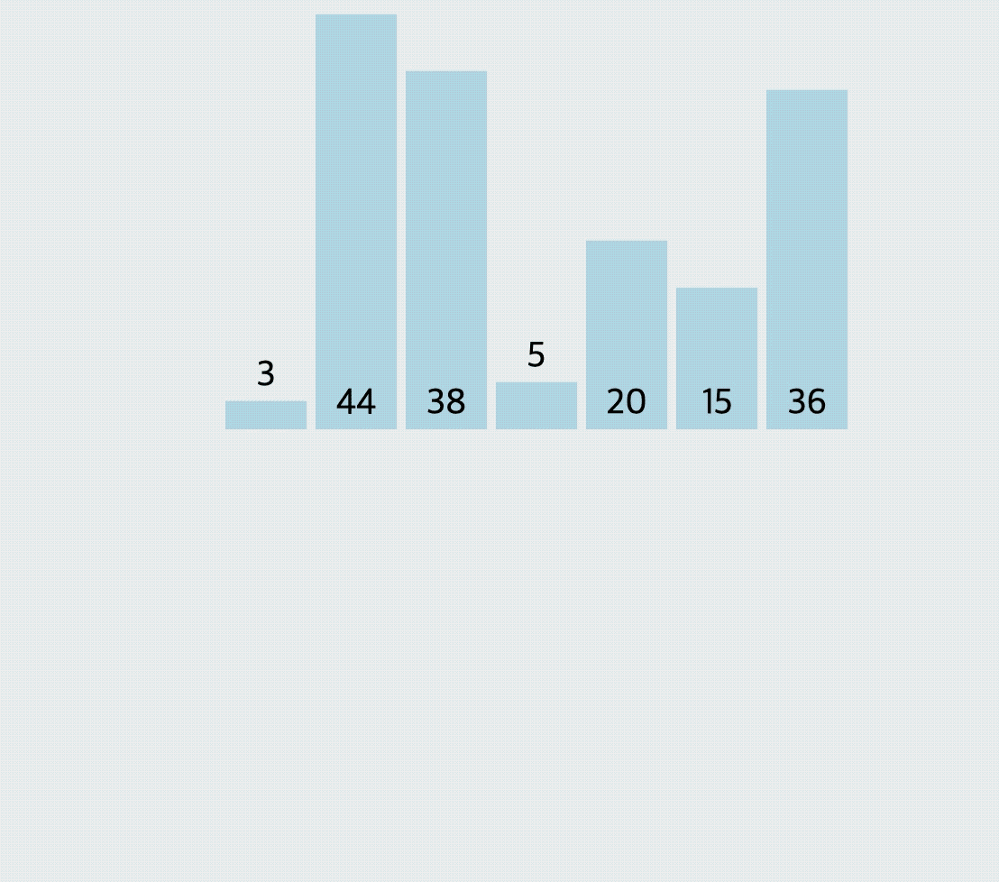

# 제로베이스 알고리즘 자료구조 51일 대비반 👨🏻‍💻

## 대표적인 정렬 1: 버블 정렬 (bubble sort)

### 1. 정렬(sorting)이란?

- 정렬: 어떤 데이터들이 주어졌을 때 이를 정해진 순서대로 나열하는 것
- 정렬은 프로그램 작성시 빈번하게 필요로 함
- 다양한 알고리즘이 고안되었으며, 알고리즘 학습의 필수
- 다양한 정렬 알고리즘 이해를 통해, 동일한 문제에 대한 다양한 알고리즘이 고안될 수 있음을 이해하고, 각 알고리즘 간 성능 비교를 통해, 알고리즘 성능 분석에 대해서도 이해할 수 있음

### 2. 버블 정렬(bubble sort) 란?

- `두 인접한 데이터를 비교해서, ① 앞에 있는 데이터가 ② 뒤에 있는 데이터보다 크면, 자리를 바꾸는 정렬 알고리즘`



출처 : https://visualgo.net/en/sorting

### 3. 어떻게 코드로 만들까?

`case 1: 데이터가 두 개일 때 버블 정렬 알고리즘 방식으로 정렬`

```py
arr = [5 , 2]

# 버블 정렬 탐색을 통해 맨 앞에서부터 2개의 인덱스를 비교하여 가장 큰 수가 뒤로 간다
if arr[1] < arr[0]:
    arr[1], arr[0] = arr[0], arr[1]

print(arr)
```

`case 2: 데이터가 세 개일 때 버블 정렬 알고리즘 방식으로 정렬`

```py
arr = [5,4,2]

if arr[1] < arr[0]:
    arr[1],arr[0] = arr[0], arr[1]
    if arr[2] < arr[1]:
        arr[2],arr[1] = arr[1], arr[2]
        if arr[1] < arr[0]:
            arr[1],arr[0] = arr[0], arr[1]
print(arr)
```

`case 3: 데이터가 네 개일 때 버블 정렬 알고리즘 방식으로 정렬`

- 다음과 같은 반복이 발견됨

| arr.length | 조건 체크 | 턴(순회) |
| :--------: | :-------: | :------: |
|     2      |     1     |    1     |
|     3      |     2     |    2     |
|     4      |     3     |    3     |

```py
arr = [5,2,3,1]

for index in range(배열의 길이 -1):
  for index 2 in range(배열의 길이 -1):
    if 앞 데이터 > 뒤 데이터:
      swap(앞 데이터, 뒤 데이터)
```

이를 바탕으로 arr의 길이가 n개일 때를 위한 코드 작성

```py
# 처음 작성한 코드

arr =[5,2,3,1,6,10, -1]

for index in range(len(arr)-1):
    for index2 in range(len(arr) -1):
        if arr[index2] > arr[index2 +1]:
            arr[index2], arr[index2+1] = arr[index2+1], arr[index2]

print('arr:', arr)
```

```py
# 이미 한 번 탐색마다 맨 뒤에는 최대 값이 고정되므로
# 2번째 순회를 돌 때는 배열의 맨 끝까지 탐색할 필요가 없다
# 따라서 for index2 in range(len(arr)- index -1): 와 같은 조건문이 나온다

arr =[5,2,3,1,6,10, -1]

for index in range(len(arr)-1):
    for index2 in range(len(arr)- index -1):
        if arr[index2] > arr[index2 +1]:
            arr[index2], arr[index2+1] = arr[index2+1], arr[index2]

print('arr:', arr)
```

**But, 데이터가 처음부터 정렬이 되어있을 경우 [1,2,3,4]에도 위의 반복문은 계속 순회를 해야 한다**

- 따라서 해당 데이터가 순회가 필요한지를 판단할 변수 swap (Boolean)를 추가하여 조건문에 넣어주었다

```py
def bubblesort(data):
    for index in range(len(data) - 1):
        # 초기에는 swap이 일어나지 않는다고 가정
        swap = False
        for index2 in range(len(data) - index - 1):
            if data[index2] > data[index2 + 1]:
                data[index2], data[index2 + 1] = data[index2 + 1], data[index2]
                # swap이 한 번 이라도 일어날 경우에는 True로 변경
                swap = True

        # 한번 순회를 했음에도 swap이 일어나지 않는다면, 반복을 중단하고 리턴한다
        if swap == False:
            break
    return data
```

### 5. 버블 정렬 알고리즘 분석

- 반복문이 두 개 O($n^2$)

  - 최악의 경우, <font size=5em>$\frac { n * (n - 1)}{ 2 }$</font>

- 완전 정렬이 되어 있는 상태라면 최선은 O(n)

## 대표적인 정렬 2: 선택 정렬 (selection sort)

### 1. 선택 정렬 (selection sort)란?

- 다음과 같은 순서를 반복하여 정렬하는 알고리즘
- 주어진 데이터 중 최소값을 찾음
- 해당 최소값을 데이터 맨 앞에 위치한 값과 교체함
- 맨 앞의 위치를 뺀 나머지 데이터를 동일한 방법으로 반복함

<hr/>

- 1. 첫 번째 인덱스의 value를 특정 변수에 담음 >>> select
- 2. 배열을 순회하며 select에 저장된 value보다 작은 값이 있을 경우 select를 교체(재할당)
- 3. 해당 작업이 완료된 경우 다음 자리 (index +1) 부터 다시 순회 시작



| (stand)<br/>비교 데이터 인덱스 | (stand +1)<br/>비교 시작 인덱스 | (data.length)<br/>비교 끝 인덱스 |
| :----------------------------: | :-----------------------------: | :------------------------------: |
|               0                |                1                |                3                 |
|               1                |                2                |                3                 |
|               2                |                3                |                3                 |
|               n                |               n+1               |           data.length            |

```py
data = [5,4,3,1]

for stand in range(데이터의 길이 -1):
  lowest = stand
  for index in range(stand+1, 데이터의 길이):
    if data[lowest] > data[index]:
      lowest = index

  swap(lowest, stand)
```

```py
data = [5, 3, 1, 10, 9, -1]

# 1. 주어진 데이터 중, 최솟값을 찾음
# 2. 해당 최솟값을 데이터 맨 앞에 위치한 값과 교체함
# 3. 맨 앞의 위치(인덱스)를 뺀 다음 데이터부터 동일한 방법으로 1-2번 과정을 반복함


def selection_sort(data):
    for standard in range(len(data) - 1):
        lowest = standard
        for index in range(standard+1, len(data)):
            if data[lowest] > data[index]:
                lowest = index
        data[standard], data[lowest] = data[lowest], data[standard]
    return data


print(selection_sort(data))
```

### 3. 선택 정렬 알고리즘 분석

- 반복문이 두 개 O($n^2$)

  - 실제로 상세하게 계산하면, <font size=5em>$\frac { n * (n - 1)}{ 2 }$</font>

## 대표적인 정렬 3: 삽입 정렬 (insertion sort)

### 1. 삽입 정렬 (insertion sort)란?

- 삽입 정렬은 `① 두 번째 인덱스`부터 시작
- `① 해당 값`을 차례대로 자신의 앞 인덱스가 가지는 value 값과 비교
- 앞 인덱스보다 `① 해당 값`이 더 작을 경우, 해당 인덱스 앞에 삽입 (swap)
- 앞 인덱스 앞에 또 다른 인덱스가 존재할 경우, 계속 앞으로 가며 value 값을 비교
- 자신의 값이 위치할 수 있는 자리(인덱스)에 삽입한다



| 데이터 길이 | 조건 체크  | 턴  |
| :---------: | :--------: | :-: |
|      2      |     1      |  1  |
|      3      |  (최대) 2  |  2  |
|      4      |  (최대) 3  |  3  |
|      n      | (최대) n-1 | n-1 |

### 알아두면 좋은 range

```py
# range(a , b, -1)
# >>> a부터 b-1 까지 내림차순으로 반복한다

for index in range(10, 1, -1):
  print(index, end='')

>>> 10, 9, 8, 7, 6, 5, 4, 3, 2
```

### 알고리즘 구현

```py
for index in range(데이터의 길이 -1):
  for index2 in range(index+1, 0, -1):
    if data[index2] < data[index2-1]:
      data[index2], data[index2-1] = data[index2-1], data[index2]
    else:
      break
```

```py
data = [5, 2, 3, 1]


def insertion_sort(data):
    for index in range(len(data)-1):
        for index2 in range(index+1, 0, -1):
            if data[index2] < data[index2-1]:
                data[index2], data[index2-1] = data[index2-1], data[index2]
            else:
                break
    return data


print(insertion_sort(data))

```

### 삽입 정렬 알고리즘 분석

- 반복문이 두 개 O($n^2$)

  - 최악의 경우, <font size=5em>$\frac { n * (n - 1)}{ 2 }$</font>

- 완전 정렬이 되어 있는 상태라면 최선은 O(n)

## 재귀 용법 (recursive call, 재귀 호출)

고급 정렬 알고리즘에서 재귀 용법을 사용하므로, 고급 정렬 알고리즘을 익히기 전에 재귀 용법을 먼저 익히기로 합니다

### 1. 재귀 용법

- 함수 안에서 동일한 함수를 호출하는 형태
- 여러 알고리즘 작성시 사용되므로, 익숙해져야 함

### 2. 재귀 용법 이해

### 팩토리얼 만들기

```py
2 ! = 1 * 2
3 ! = 1 * 2 * 3
4 ! = 1 * 2 * 3 * 4

...

n ! = n * (n-1)!
```

팩토리얼은 다음과 같은 규칙을 가지므로 이를 바탕으로 한 함수를 만든다

| func(n) | case  |         함수          |
| :-----: | :---: | :-------------------: |
| func(n) | n > 1 | return n \* func(n-1) |
|         | n = 1 |       return n        |

```py
def factorial(num):
  if num > 1:
    return num * factorial(num-1)
  else:
    return num
```

```py
print(factorial(4))

>>>
24
```

### 3. 재귀 호출의 일반적인 형태

```py
case 1 :
  def function(입력):
    if 입력 > 일정값: # 입력이 일정 값 이상이면
      return function(입력 -1) # 입력보다 작은 값을 인수로 함수 호출
    else:
      return 일정값, 입력값, 또는 특정값 # 재귀 호출 종료
```

```py
case 2 :
  # 일반적인 형태2
  def function(입력):
      if 입력 <= 일정값:              # 입력이 일정 값보다 작으면
          return 일정값, 입력값, 또는 특정값              # 재귀 호출 종료
      function(입력보다 작은 값)
      return 결과값
```

### 재귀 호출은 스택의 전형적인 예

**재귀 함수는 내부적으로 스택처럼 관리한다**


### 4. 재귀 용법을 활용한 프로그래밍 연습

> 다음 함수를 재귀 함수를 활용해서 완성하여 1부터 Num까지 곱이 출력되게 만들기

```py
def multiple(data):
  if data <= 1:
    return data

  return ---------------

multiple(10)
```

```py
# 재귀 호출문일 경우

def multiple(data):
    if data <= 1:
        return data

    return data * multiple(data-1)

multiple(3)
```

```py
# 일반 반복문일 경우

def multiple(num):
    return_value = 1
    for index in range(1, num + 1):
        return_value = return_value * index
    return return_value
```

### 유효한 팰린드롬

<div class="alert alert-block alert-warning">
<strong><font color="blue" size="4em">프로그래밍 연습</font></strong><br>
회문(palindrome)은 순서를 거꾸로 읽어도 제대로 읽은 것과 같은 단어와 문장을 의미함<br>
회문을 판별할 수 있는 함수를 리스트 슬라이싱을 활용해서 만드세요

</div>
<pre>
참고 - 리스트 슬라이싱
string = 'Dave' 
string[-1] --> e
string[0] --> D
string[1:-1] --> av
string[:-1] --> Dav
</pre>

### 내가 만든 펠린드롬 (리스트 슬라이싱)

```py

def function(data: str):
    A = list()
    C = list(data)
    for index in range(len(data)):
        A.append(data[index])
    if C == A[::-1]:
        return True
    else:
        return False


function('level')
```

### 재귀 함수를 이용한 팰린드롬

```py
def palindrome(string):
    if len(string) <= 1:
        return True

    if string[0] == string[-1]:
        return palindrome(string[1:-1])
        # 내부에서 펠린드롬 함수를 요청할 때 'goog'의 경우 goog[1:-1]인 'oo'를 인수로 한다
        # 재귀 용법으로는 다음과 같이 풀 수 있다
    else:
        return False
```

### 프로그래밍 연습

<div class="alert alert-block alert-warning">
<strong><font color="blue" size="4em">프로그래밍 연습</font></strong><br>
1, 정수 n에 대해<br>
2. n이 홀수이면 3 X n + 1 을 하고,<br>
3. n이 짝수이면 n 을 2로 나눕니다.<br>
4. 이렇게 계속 진행해서 n 이 결국 1이 될 때까지 2와 3의 과정을 반복합니다.<br>
<br>
예를 들어 n에 3을 넣으면,  
<pre>
3
10
5
16
8
4
2
1
</pre>
이 됩니다.

이렇게 정수 n을 입력받아, 위 알고리즘에 의해 1이 되는 과정을 모두 출력하는 함수를 작성하세요.

```py
def func(n):
    print(n)
    if n == 1:
        return n
    # 홀수라면
    if n % 2 == 1:
        return func(int(3 * n + 1))
    else:
        return func(int(n / 2))


print(func(3))

>>>
3
10
5
16
8
4
2
1

1
```

## 동적 계획법(Dynamic Programming)과 분할 정복(Divide and Conquer)

### 1. 정의

### 동적 계획법 (Dynamic Programming)

- DP 라고 많이 부른다
- 입력 크기가 작은 부분의 문제들을 해결한 후, 해당 부분 문제의 해를 활용해서, 보다 큰 크기의 부분 문제를 해결
- 최종적으로는 전체 문제를 해결하는 알고리즘
- 상향식 접근법으로 가장 최하위 해답을 구한 이후, 이를 바탕으로 상위 문제를 풀어가는 방식

- 메모이제이션 기법을 사용함

  - Memoization(메모이제이션) 이란: 프로그램 실행 시 이전에 계산한 값을 저장한다
  - 이를 통해 해당 부분을 다시 계산하지 않도록 하여 전체 실행 속도를 빠르게하는 기술
  - 문제를 잘게 쪼갤 때, 부분 문제는 중복되어 제활용된다 (예: 피보나치 수열)

### 분할 정복 (Divide and Conquer)

- 문제를 나눌 수 없을 때까지 나누어서 각각을 풀면서 다시 합병하여 문제의 답을 얻는 알고리즘
- 하향식 접근법으로, 상위의 해답을 구하기 위해 아래로 내려가면서 하위의 해답을 구하는 방식
- 일반적으로 재귀함수로 구현한다
- 문제를 잘게 쪼갤 때, 부분 문제는 서로 중복되지 않는다
- 병합 정렬, 퀵 정렬에서 주로 사용되는 기법이다

### 2. 공통점과 차이점

### 공통점

- 문제를 잘게 쪼개서, 가장 작은 단위로 분할한다
- **더 이상 조건문이 재귀함수를 호출할 수 없는 상태까지 🔥**

### 차이점

- 동적 계획법

  - 부분 문제는 중복되어, 상위 문제 해결 시 재활용됨
  - 메모이제이션 기법 사용 (부분 문제의 해답을 저장해서 재활용하는 최적화 기법으로 사용)

- 분할 정복

  - 부분 문제는 서로 중복되지 않음
  - 메모이제이션 기법 사용 x

### 3. 동적 계획법 알고리즘 이해

<div class="alert alert-block alert-warning">
<strong><font color="blue" size="4em">프로그래밍 연습</font></strong><br>
피보나치 수열: n 을 입력받아서 다음과 같이 계산됨<br>
n 을 입력받았을 때 피보나치 수열로 결과값을 출력하세요<br>
</div>

<pre>
함수를 fibonacci 라고 하면,
fibonacci(0):0
fibonacci(1):1
fibonacci(2):1
fibonacci(3):2
fibonacci(4):3
fibonacci(5):5
fibonacci(6):8
</pre>


- 그림에서 볼 수 있듯이 f(6)을 계산하기 위해 상향식으로 f(0), f(1), ... f(6)으로 접근한다
- 이진 탐색 트리 구조로, f(6)을 이루는 f(0), f(1), f(2) ,.. f(n)은 메모이제이션 기법에 의해 재사용한다

### recursive call (재귀 함수)활용

```py
def fibo(num):
  if num <= 1:
    return num
  return fibo(num-1) + fibo(num-2)
```

```py
fibo(4)

>>> 3
```

```py
# fibo(4) = fibo(3) + fibo(2)
# fibo(3) = fibo(2) + fibo(1)
# fibo(2) = fibo(1) + fibo(0)
```

### 동적 계획법 활용 (다이나믹 프로그래밍, DP)

- 메모이제이션 기법을 사용
- 리스트 컴프리헨션을 통해 리스트 구조 생성

```py
# 리스트 컴프리헨션

data = [0 for index in range(10)]
print('data:', data)

data2 = [index for index in range(10)]
print('data2:', data2)

data3 = [index+1 for index in range(10)]
print('data3:', data3)

>>>
data: [0, 0, 0, 0, 0, 0, 0, 0, 0, 0]
data2: [0, 1, 2, 3, 4, 5, 6, 7, 8, 9]
data3: [1, 2, 3, 4, 5, 6, 7, 8, 9, 10]
```

```py
def fibo_dp(num):
    cache = [ 0 for index in range(num + 1)]
    cache[0] = 0
    cache[1] = 1

    # 0, 1의 자리는 피보나치 수열 기초 계산 식에 의해 먼저 삽입하였다
    # num이 들어오는 수 이므로 range를 사용하기 위해 num+1 (num까지 순회)로 적음
    for index in range(2, num + 1):
        cache[index] = cache[index - 1] + cache[index - 2]
    return cache[num]
```

## 대표적인 정렬 5: 퀵 정렬 (quick sort)

### 1. 퀵 정렬 (quick sort) 이란?

- **정렬 알고리즘의 꽃 🔥**
- 기준점(피봇, pivot)을 정해서, 기준점보다 작은 데이터는 왼쪽(left), 크거나 같은 데이터는 오른쪽(right)으로 모으는 함수를 작성
- 각 왼쪽, 오른쪽은 재귀용법을 사용해서 다시 동일한 함수를 호출하여 위 작업을 만복
- 함수는 왼쪽 + 기준점(pivot) + 오른쪽을 리턴함

### 3. 알고리즘 구현

- 만약 리스트의 개수(len)가 1개라면 해당 리스트를 리턴 (순회할 필요가 없기 때문)
- 그렇지 않으면, 리스트 맨 앞의 인덱스를 기준점(pivot)으로 놓기
- list 타입의 left, right 변수 생성
- 맨 앞의 인덱스(pivot)을 뺀 나머지 데이터를 기준점(pivot)과 비교

  - 기준점보다 작으면 left.append()
  - 기준점보다 크거나 같으면 right.append()

- return quicksort(left) + pivot + quicksort(right)로 재귀 호출

```py
def quick_sort(data):
    if len(data) <= 1:
        return data
    left, right = list(), list()
    pivot = data[0]

    for index in range(1, len(data)):
        if pivot > data[index]:
            left.append(data[index])
        else:
            right.append(data[index])

    return quick_sort(left) + [pivot] + quick_sort(right)
```

```py
import random

data_list = random.sample(range(100),10)

quick_sort(data_list)

>>>
[3, 14, 17, 33, 45, 53, 64, 78, 88, 98]
```

### 리스트 컴프리헨션 사용하기

```py
def qsort(data):
    if len(data) <= 1:
        return data

    pivot = data[0]

    left = [ item for item in data[1:] if pivot > item ]
    right = [ item for item in data[1:] if pivot <= item ]

    return qsort(left) + [pivot] + qsort(right)
```

```py
import random

data_list = random.sample(range(100), 10)

qsort(data_list)

>>>
[5, 10, 37, 43, 61, 71, 77, 78, 82, 84]
```

### 4. 알고리즘 분석

- <font color='#BF360C'>병합정렬과 유사, 시간복잡도는 O(n log n)</font>
- 단, 최악의 경우 - 맨 처음 pivot이 가장 크거나, 가장 작으면 - 모든 데이터를 비교하는 상황이 나옴

  - O($n^2$)


