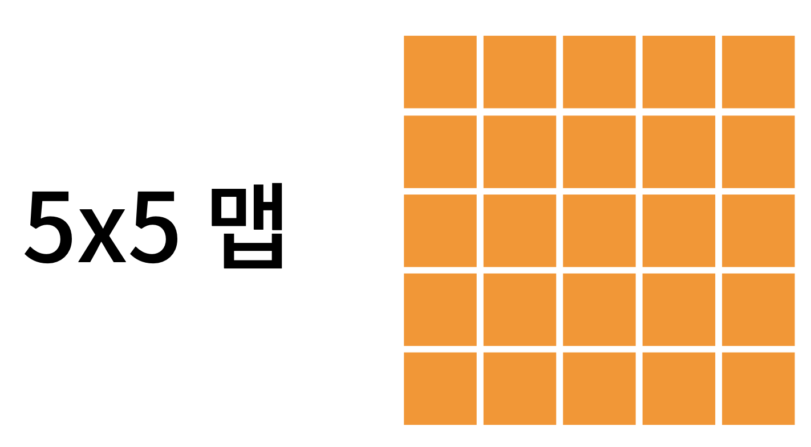
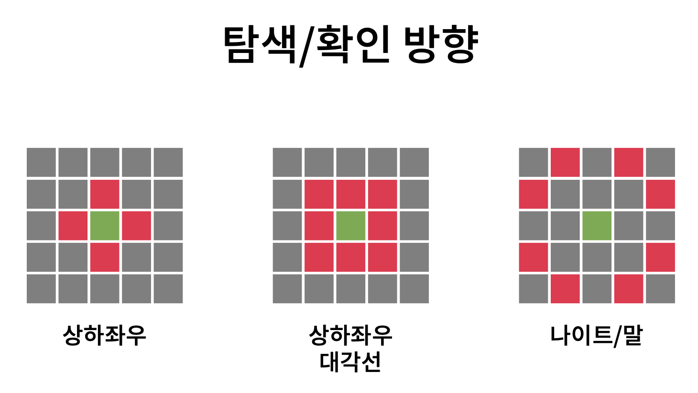
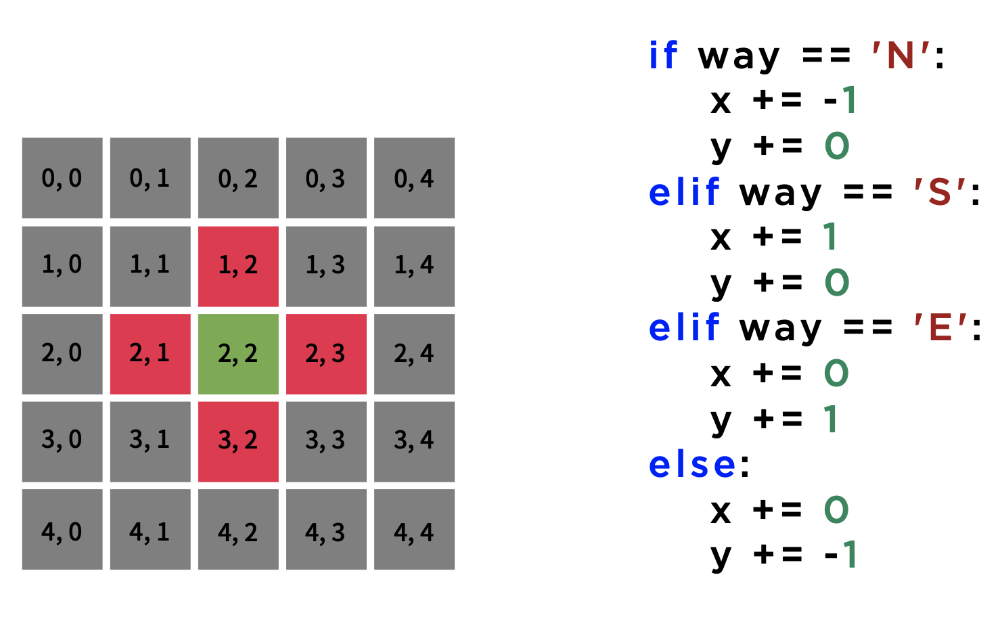
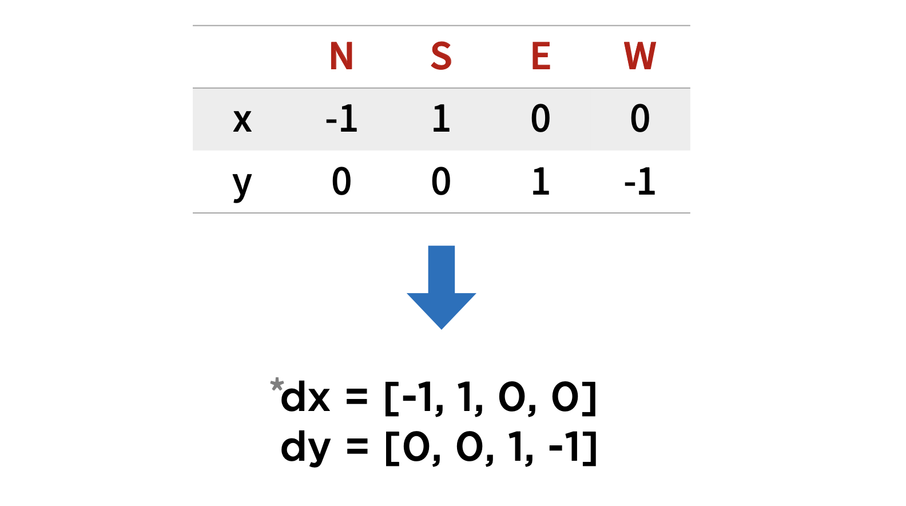

# 대표 유형

코딩 테스트란

- 주어진 시간 동안
- 주어진 문제를
- 요구사항에 맞게
- 프로그래밍하여
- Accept나 점수를 받는 시험

## 과정

1. 문제
2. 모델링
3. 절차적 사고
4. 구현

## 종류

|               종류                |   유형   |
| :-------------------------------: | :------: |
|     파싱,해싱,정렬,시뮬레이션     |   구현   |
| 탐색(BFS/DFS), 완전탐색(백트래킹) |   탐색   |
|    자료구조(스택, 큐, 힙 등),.    |   구조   |
|       그리디, DP, 이분탐색        | 알고리즘 |

## 에러

|           종류           |     유형     |
| :----------------------: | :----------: |
|       컴파일 에러        |  문법 오류   |
|      시간 초과(TLE)      | 최적화 필요  |
|     메모리 초과(MLE)     | 최적화 필요  |
|     런타임 에러(RE)      |  과정 오류   |
| 틀렸습니다(Wrong Answer) | 수 많은 이유 |

## 틀렸습니다 ?

- 제한 및 대소 관계 (이상, 이하, 초과, 미만, min, max)
- 예외 처리 (단, 없는 경우는 -1을 출력한다)
- 입력과 출력 (공백, 양식, 순서, 정렬 유무)
- 시간 제한과 메모리 제한

## 내가 어려워하는 부분 찾기

### 문제 모델링이 어려워요

- 수치 및 조건 정리하기
- 전체적인 흐름 그리기
- 입출력 예제 이해하기

```py
# 10명의 ** 값이 정수로 주어진다면?

A = [int(input()) for i in range(10)]

# ~를 체크해야 한다
def check(x):
  pass
```

### 문제가 막혀요

- 필수 알고리즘은 암기 (다다익선)
- 설명과 함께 풀어보기/ 유형은 많이 풀기
- 모델링을 바탕으로 기능을 가볍게 적어보기

## 코딩 테스트 유형별 분석

### 구현

프로그래밍의 기초: 구현

구현:

- 어떤 내용이 구체적인 사실로 나타나게 함

- 문제 조건을 코드로 작성하여 돌아가게 함

내장 함수를 잘 사용하기

### 자료형의 기본 활용과 Tip

`기본 자료형`

| single(단일 자료) | container(다중 자료) |
| :---------------: | :------------------: |
|      Integer      |         List         |
|       Float       |        Tuple         |
|      String       |      Dictonary       |
|      Boolean      |         Set          |

### Integer

- 수의 크기 제한이 딱히 없음 > overFlow 걱정을 줄일 수 있음
- str()로 쉬운 형변환
- 연산/함수 사용 시, float로 변환되는 경우

  - 나눗셈은 `/`가 아닌 `//`로 안전하게 나눌 수 있음 (또는 divmod 사용)

```py
# 나누기
3 / 3 >>> 1.0

type(3/3) >>> float

## //로 나누기

3 // 3 >>> 1
type(3//3) >>> int

## divmod(a,b)
divmod(7,3)

>>> (2,1)
```

### String

- Immutable한 변수

  - List로 변환해서 사용하기

- `+` 연산과 `*` 연산 조심하기

  - join() method 활용하기

- .split() .replace() 등 다양한 method 활용이 초점
- Slicing을 자유롭게 할 수 있는 것
- Char를 ord와 chr로 다루기

```py
### ASCI 코드 변환

chr(65) >>> 'A'

ord('A') >>> 65
```

### Boolean

- 논리 연산과 활용
- Short Circuit

  - or 연산에 앞 항이 참
  - and 연산에 앞 항이 거짓

- 모든 문제의 기본: 참/거짓

```py
# Short Circuit의 활용


if 1//0:
    print('hello') >>> # ZeroDivisionError: integer division or modulo by zero

if 0 and 1//0:
    print('hello') >>> 'hello'

if 1 or 1//0:
    print('hello') >>> 'hello'

```

### List

- List Comprehension 사용하기
- sort와 sorted 구분하기
- len, sum, max, min 등 활용하기
- Slicing, `[-1]`emd dmatn dlseprtm ghkfdyd
- reduce, filter도 활용하면 좋음

```py
### List Comprehension

list_arr = [i for i in range(10)]
print(list_arr)

>>> [0, 1, 2, 3, 4, 5, 6, 7, 8, 9]

### None List Comprehension

list_arr2 = list()

for i in range(10):
    list_arr2.append(i)

print(list_arr2)

>>> [0, 1, 2, 3, 4, 5, 6, 7, 8, 9]
```

```py
# sort & sorted

list = [3, 5, 6, 9, 2]

# sorted: 원본 배열을 변환시키지 않음
print(sorted(list))
>>> [2,3,5,6,9]

print(list)
>>> [3,5,6,9,2]

# sort: 원본 배열을 변환
list.sort()
print(list)

>>> [2,3,5,6,9]

```

### Tuple

- 초기 상태 표현시 코드가 길어지는 것 방지

  - ex) a,b,c = 0,0,0

- Map과 함께 사용하여 입력 받기

  - ex) a,b = map(int, input().split())

- 동시에 변해야하는 객체에 효율적 표현 가능

  - ex) a,b = b,a (swap)

```py
a, b = map(int, input().split())

print('a,b:', a, b)

>>>
3 7
a,b: 3 7
```

### Dictonary

- Keys나 values를 사용하여 효율적인 사용 추천
- 반복문 돌리기

  - ex) for a,b in dict_exam: ~

- 개인적으로는 문자열 자체를 index로 사용하고 싶은 경우

  - 단어나 알파벳 카운팅

### Set

- 중복 체크

  - set(list) 사용

- 합집합, 여집합, 차집합 등 집합 연산

  - 시간 복잡도가 크니 주의해서 사용

```py
st = set([1, 2, 3, 4, 5, 1, 2, 3, 4, 5, 1, 2, 3])

print('st:', st)
>>> st: {1, 2, 3, 4, 5}
```

```py
# 중복 체크

def isCheck(list):
  return len(list) == len(set(list))
```

# 매개변수의 이해와 구조화

## Container의 역할

- 자료형에 따른 본인만의 container 설정과 이해

  - Tuple: 위치(index)에 따른 의미
  - Set: 포함 여부의 의미
  - List: index와 원소의 관계
  - Dict: key와 value의 관계

- 함수와 마찬가지로 적절한 명명 필요

# 예외처리

## 1. 논리 연산자/ 비트 연산자 활용하기

```py
a,b = 10, 20

# case 1:

if a > b:
  if a % 10 == 0:
    print(a)

# case 2: 논리 연산자 (and or not) 사용하기
if a > b and a % 10 == 0:
  print(a)
```

```py
1 << 2
1 & 1
1 | 1
1 ^ 1
```

## 2. 상태를 나타내는 자료 활용하기

```py
N = 71

# check 변수
ck = False

for i in range(2, N):
  if N % i == 0:
    print("Not Prime")
    ck = True
    break

if not ck:
  print("Prime")
```

## 3. 나눠서 진행하기

```py
# case 1 : 나누지 않을 경우
N = 71

ck = False

for N in range(10, 100):
  for i in range(2, N):
    if N % i == 0:
      print("Not Prime")
      ck = True
      break

  if not ck:
    print("Prime")
```

```py
# case 2 : 나눌 경우

def isPrime(N):
  for i in range(2, N):
    if N % i == 0:
      return False
    return True

for N in range(10, 100):
  if isPrime(N):
    print(N,"is Prime")
  else:
    print("Not Prime)
```

## 4. 여러 자료구조와 메서드, 함수 활용하기

```py
# case 1 : 일반적인 팰린드롬 확인하기

S = "hello"

for idx in S:
  if S[idx] != s[len(S)-idx-1]:
    print("Not Palindrome")
```

```py
# case 2 : 파이썬 리스트 슬라이싱 사용하기
S = "hello"

if S == S[::-1]:
  print("is Palindrome")
```

```py
def isUnique(lst):
  return len(lst) == len(set(lst))
```

## 5. 미리 처리한 케이스와 처리할 케이스 정리하기

```py
# 1. 예제 케이스

# 2. 조건 A처리

# 3. 조건 B처리

# 4. 조건 AB처리
```

# 방향 벡터

- **대표적인 문제 BFS/DFS**

- 2/3 차원 배열

- 5 \* 5 맵



## 탐색/확인 방향

- 상하좌우
- 상하좌우 대각선
- 나이트/말

**상하좌우**

```
N = North 북
S = South 남
E = East 동
W = West 서
```



**상하좌우 탐색하기**



**좌표로 나타내기**



동쪽을 기준으로 시계방향 또는 반시계 방향으로 표기

```py
# 기본 방향
dx = [-1, 1, 0, 0]
dy = [0, 0, 1, -1]

# 반시계 방향
dx = [0, -1, 0, 1]
dy = [1, 0 , -1, 0]

>>>
dx, dy = [0, -1, 0, 1], [1, 0 , -1, 0]

# 시계 방향
dx = [0, 1, 0, -1]
dy = [1, 0, -1, 0]

>>>
dx, dy = [0, 1, 0, -1], [1, 0, -1, 0]
```

```py
# dx, dy를 미리 선언해줬다는 가정하에 (반시계 방향)
dx, dy = [0, -1, 0, 1], [1, 0 , -1, 0]

# 해당 조건문을 아래와 같이 줄여서 쓸 수 있음
if way == 'N':
  x -= 1
elif way == 'N':
  x += 1
elif way == 'N':
  y += 1
else:
  y -=1

x += dx['ENSW'.index(way)]
y += dy['ENSW'.index(way)]
```

**방향에 따른 DFS를 순회할 때 다음과 같이 사용할 수 있음**

```py
for i in range(4):
  dfs(x+dx[i], y+dy[i])
```

# 탐색의 개념과 유형

- BFS : Queue (큐로 풀이)
- DFS : Recursion or Stack (재귀 또는 스택으로 풀이)

## 탐색 문제의 초점

1. 구현에 초점

- BFS/ DFS, 백트래킹에 수 많은 조건

- 1. 부분 상태 탐색 (위치 이동, 수)
- 2. 전체 상태 탐색 (전체 map)
- 3. Flood Fill
- 4. 트리 순회

2. 알고리즘 지식

- 알고리즘을 공부한 적이 있다면 이정도는 구현할 줄 알아야지

- 1. 위상정렬(Topological Sort)
- 2. 최소신장트리 (MST)
- 3. 최단 거리
