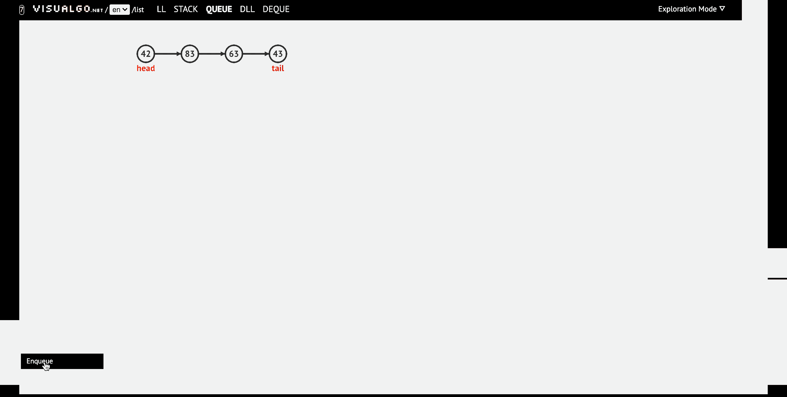
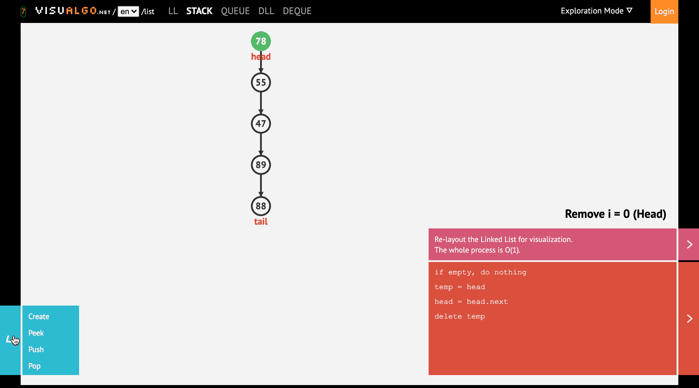
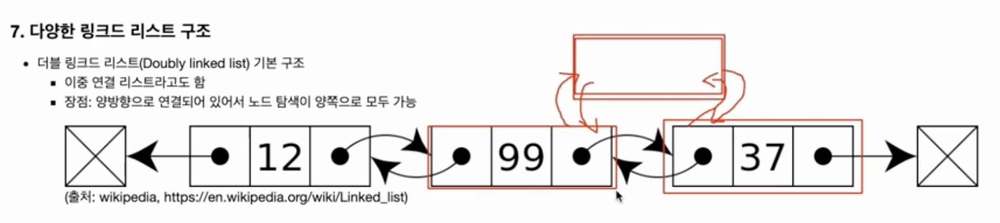

# 제로베이스 알고리즘 자료구조 51일 대비반 👨🏻‍💻

## 2021.10.25, day 12

### 자료구조란?

- 용어: 자료구조, 데이터 구조, data structure
- 대량의 데이터를 효율적으로 관리할 수 있는 데이터의 구조를 의미
- 코드 상에서 효율적으로 데이터를 처리하기 위해, 데이터 특성에 따라, 체계적으로 데이터를 구조화해야 함
- 어떤 데이터 구조를 사용하느냐에 따라, 코드 효율이 달라진다

#### 효율적으로 데이터를 관리하는 예

- 우편번호: 5자리 우편번호로 국가의 기초구역을 제공
- 5자리 우편번호에서 앞 3자리는 시, 군, 자치구를 표기, 뒤 2자리는 일련번호로 구성

- 학생 관리: 학년, 반, 번호를 학생에게 부여해서, 학생부를 관리
- XX학년, X반, X번 학생
- 만약 위 관리 기법이 없다면, 3000명 학생 중 특정 학생을 찾기 위해, 전체 학생부를 모두 훑어야 함

#### 대표적인 자료구조

- 배열, 스택, 큐, 링크드 리스트, 해쉬 테이블, 힙 등

> 현실 세계의 가장 대표적인 자료 구조 ? >>> 사전

### 알고리즘이란?

- 용어: 알고리즘, algorithm
- 어떤 문제를 풀기 위한 절차/방법
- 어떤 문제에 대해, 특정한 '엽력'을 넣으면, 원하는 '출력'을 얻을 수 있도록 만드는 프로그래밍
- ① 얼마나 효율적이냐(시간이 걸리느냐), ② 얼마의 저장 공간을 활용하느냐가 핵심 요소가 된다

> 현실 세계의 가장 대표적인 알고리즘? >>> 백종원 레시피

#### 자료구조와 알고리즘이 중요한 이유

- 어떤 자료구조와 알고리즘을 쓰느냐에 따라, 성능이 천지차이이다
- 결국 프로그래밍을 잘 할 수 있는 기술과 역량을 익히고, 검증할 수 있다

### 파이썬/ 주피터 노트북 설치

#### 프로그램 설치: anaconda 설치

- anaconda란?

  - 파이썬 기본(컴파일러)
  - 파이썬 주요 라이브러리
  - `jupyter notebook` 등 유용한 툴

- 참고

  - 컴파일러: 프로그래밍 언어로 작성된 코드를 컴퓨터가 실행할 수 있는 코드로 변환하는 프로그램ㅇ
  - 파이썬의 장점: 라이브러리

  `pip install 라이브러리 명`

#### jupyter notebook이란?

- Editor(PyCharm) VS jupyter notebook

  - 한줄 한줄 코드 실행 결과 확인이 쉽다
  - 문서와 코드를 함께 작성/저장할 수 있다

- 복잡한 자료구조/알고리즘을 보다 쉽게 정리하고, 익히기 위해 사용

## 2021.10.26, day 13

### `[자료구조]` 배열

#### 꼭 알아둬야 할 자료 구조: 배열 (Array)

- 데이터를 나열하고, 각 데이터를 인덱스에 대응하도록 구성한 데이터 구조
- 파이썬에서는 리스트 타입이 배열 기능을 제공함

#### 1. 배열은 왜 필요할까?

- 같은 종류의 데이터를 효율적으로 관리하기 위해 사용
- 같은 종류의 데이터를 순차적으로 저장
- 장점:

  - 빠른 접근 가능
  - 첫 데이터의 위치에서 상대적인 위치로 데이터 접근(인덱스 번호로 접근)

- 단점:

  - 데이터 추가/삭제의 어려움
  - 미리 최대 길이를 지정해야 함

#### make a list using C

- C 언어에서 배열을 사용할 경우 배열의 최대 길이를 사전에 정의해줘야 한다

```c
#include <stdio.h>

int main(int argc, char * argv[])
{
    char country[3] = "US";
    printf ("%c%c\n", country[0], country[1]);
    printf ("%s\n", country);
    return 0;
}
```

#### make a list using Python

- Python, JS의 경우 배열(문자열)의 길이를 사전에 정해주지 않아도 동작한다

```py
country = 'US'
print (country)

country = country + 'A'
print(country)
```

#### 2. 파이썬과 배열¶

- 파이썬에서는 리스트로 배열 구현 가능

```py
# 1차원 배열: 리스트로 구현시
data_list = [1, 2, 3, 4, 5]
data_list
```

```py
# 2차원 배열: 리스트로 구현시
data_list = [[1, 2, 3], [4, 5, 6], [7, 8, 9]]
data_list
```

```py
print (data_list[0])

print (data_list[0][0])
print (data_list[0][1])
print (data_list[0][2])
print (data_list[1][0])
print (data_list[1][1])
```

#### practice

- 위의 dataset 리스트에서 전체 이름 안에 'M'은 몇 번 나왔는지 빈도수 출력하기

```py
dataset = ['Braund, Mr. Owen Harris',
'Cumings, Mrs. John Bradley (Florence Briggs Thayer)',
'Heikkinen, Miss. Laina',
'Futrelle, Mrs. Jacques Heath (Lily May Peel)',
'Allen, Mr. William Henry',
'Moran, Mr. James',
'McCarthy, Mr. Timothy J',
'Palsson, Master. Gosta Leonard',
'Johnson, Mrs. Oscar W (Elisabeth Vilhelmina Berg)',
'Nasser, Mrs. Nicholas (Adele Achem)',
'Sandstrom, Miss. Marguerite Rut',
'Bonnell, Miss. Elizabeth',
'Saundercock, Mr. William Henry',
'Andersson, Mr. Anders Johan',
'Vestrom, Miss. Hulda Amanda Adolfina',
'Hewlett, Mrs. (Mary D Kingcome) ',
'Rice, Master. Eugene',
'Williams, Mr. Charles Eugene',
'Vander Planke, Mrs. Julius (Emelia Maria Vandemoortele)',
'Masselmani, Mrs. Fatima',
'Fynney, Mr. Joseph J',
'Beesley, Mr. Lawrence',
'McGowan, Miss. Anna "Annie"',
'Sloper, Mr. William Thompson',
'Palsson, Miss. Torborg Danira',
'Asplund, Mrs. Carl Oscar (Selma Augusta Emilia Johansson)',
'Emir, Mr. Farred Chehab',
'Fortune, Mr. Charles Alexander',
'Dwyer, Miss. Ellen "Nellie"',
'Todoroff, Mr. Lalio']
```

<details>
<summary>using python 🔥</summary>

```py
count = 0
for data in dataset:
    #     print('data:',data)
    for idx in range(len(data)):
        # print('data[idx]:', idx, data[idx])
        if data[idx] == 'M':
            count += 1

print('count:', count)

```

</details>

<details>
<summary>using JS 🔥</summary>

```js
for (x of dataset) {
  for (ele of x) {
    if (ele.indexOf("M") !== -1) cnt++;
  }
}

console.log(cnt);
```

</details>

#### 참고

- range(stop): range(10)은 0, 1, 2, 3, 4, 5, 6, 7, 8, 9
- range(start, stop): range(1, 11)은 1, 2, 3, 4, 5, 6, 7, 8, 9, 10
- range(start, stop, step): range(0, 20, 2)은 0, 2, 4, 6, 8, 10, 12, 14, 16, 18

  - start, stop, step은 음수로 지정 가능

### `[자료구조]` 큐 Queue

#### 1. 큐 구조

- 줄을 서는 행위와 유사
- 가장 먼저 넣은 데이터를 가장 먼저 꺼낼 수 있는 구조
- 음식점에서 가장 먼저 줄을 선 사람이 제일 먼저 음식점에 입장하는 것과 동일
- FIFO(First-In, First-Out) 또는 LILO(Last-In, Last-Out) 방식으로 스택과 꺼내는 순서가 반대


- 출처: http://www.stoimen.com/blog/2012/06/05/computer-algorithms-stack-and-queue-data-structure/



#### 2. 알아둘 용어

- Enqueue: 큐에 데이터를 넣는 기능 (JS에서 push)
- Dequeue: 큐에서 데이터를 꺼내는 기능 (JS에서 shift)

#### 3. 파이썬 queue 라이브러리 활용해서 큐 자료 구조 사용하기

- queue 라이브러리에는 다양한 큐 구조로 ① Queue(), ② LifoQueue(), ③ PriorityQueue() 제공
- 프로그램을 작성할 때 프로그램에 따라 적합한 자료 구조를 사용

- Queue(): 가장 일반적인 큐 자료 구조
- LifoQueue(): 나중에 입력된 데이터가 먼저 출력되는 구조 (스택 구조라고 보면 됨)
- PriorityQueue(): 데이터마다 우선순위를 넣어서, 우선순위가 높은 순으로 데이터 출력

#### 3.x 큐 자료구조 모두 사용하기

<details>
<summary> Queue() </summary>

```py
# 큐 (Queue)

import queue

# FIFO QUEUE (일반적인 구조의 큐) 사용하기

data_queue = queue.Queue()

print('data_queue:', data_queue)
print('type:', type(data_queue))

print()

# 데이터 삽입 (put)

data_queue.put(1)
data_queue.put(2)
data_queue.put(3)

print('data_queue.qsize():', data_queue.qsize()) >>> 3

print()

# 데이터 추출 (get)

print('data_queue.get():', data_queue.get()) >>> 1
print('data_queue.get():', data_queue.get()) >>> 2
print('data_queue.get():', data_queue.get()) >>> 3

```

</details>

<details>
<summary> LifoQueue() </summary>

```py
import queue

# LIFO QUEUE (스택과 같은 구조의 큐) 사용하기

data_queue = queue.LifoQueue()

print('data_queue:', data_queue)
print('type:', type(data_queue))

print()

# 데이터 삽입 (put)

data_queue.put(1)
data_queue.put(2)
data_queue.put(3)

print('data_queue.qsize():', data_queue.qsize()) >>> 3

print()

# 데이터 추출 (get)

print('data_queue.get():', data_queue.get()) >>> 3
print('data_queue.get():', data_queue.get()) >>> 2
print('data_queue.get():', data_queue.get()) >>> 1

```

</details>

<details>
<summary> PriorityQueue() </summary>

```py
# PriorityQueue() 우선 순위가 있는 큐 만들기

import queue

data_queue = queue.PriorityQueue()

# - 튜플 형식 ( , )으로 데이터를 삽인한다
# - 숫자가 낮을수록 우선순위가 높다 (1 <<<<< 우선 순위가 높음 , .... , 15 <<<< 우선 순위가 낮음)
# - 우선순위가 높은 튜플이 먼저 Dequeue 된다

data_queue.put((10, "korea"))
data_queue.put((5, 1))
data_queue.put((15, "china"))

print()

print(data_queue.qsize())  # >>> 3

print()

print(data_queue.get())  # >>> (5,1)
print(data_queue.get())  # >>> (10, 'korea')
print(data_queue.get())  # >>> (15, 'china')
```

</details>

#### 참고) 어디에 큐가 많이 쓰일까?

- 멀티 태스킹을 위한 프로세스 스케쥴링 방식을 구현하기 위해 많이 사용됨 (운영체제 참조)

#### 4 프로그래밍 연습

**제공되는 queue 클래스 직접 구현해보기**

```py
queue_list = list()


def enqueue(data):
    queue_list.append(data)


def dequeue():
    data = queue_list[0]
    del queue_list[0]
    return data


for index in range(10):
    enqueue(index)

print('queue_list:', queue_list)
# >>> queue_list: [0, 1, 2, 3, 4, 5, 6, 7, 8, 9]

dequeue()

print('queue_list:', queue_list)
# >>> queue_list: [1, 2, 3, 4, 5, 6, 7, 8, 9]

```

### `[자료구조]` 스택 Stack

#### 꼭 알아둬야 할 자료 구조: 스택 (Stack)

- 데이터를 제한적으로 접근할 수 있는 구조

  - 한쪽 끝에서만 자료를 넣거나 뺄 수 있는 구조

- 가장 나중에 쌓은 데이터를 가장 먼저 빼낼 수 있는 데이터 구조

  - 큐: FIFO 정책
  - 스택: LIFO 정책

#### 1. 스택 구조

- 스택은 LIFO(Last In, Fisrt Out) 또는 FILO(First In, Last Out) 데이터 관리 방식을 따름

  - LIFO: 마지막에 넣은 데이터를 가장 먼저 추출하는 데이터 관리 정책
  - FILO: 처음에 넣은 데이터를 가장 마지막에 추출하는 데이터 관리 정책

- 대표적인 스택의 활용

  - 컴퓨터 내부의 프로세스 구조의 함수 동작 방식

- 주요 기능
  - push(): 데이터를 스택에 넣기
  - pop(): 데이터를 스택에서 꺼내기



### 2. 자료 구조 스택의 장단점

- 장점

  - 구조가 단순해서, 구현이 쉽다.
  - 데이터 저장/읽기 속도가 빠르다.

- 단점 (일반적인 스택 구현시)

  - 데이터 최대 갯수를 미리 정해야 한다. 🔥

    - 파이썬의 경우 재귀 함수는 1000번까지만 호출이 가능함

  - 저장 공간의 낭비가 발생할 수 있음

    - 미리 최대 갯수만큼 저장 공간을 확보해야 함

- 스택은 단순하고 빠른 성능을 위해 사용되므로, 보통 배열 구조를 활용해서 구현하는 것이 일반적임.
- 이 경우, 위에서 열거한 단점이 있을 수 있음

### 3. 파이썬 리스트 기능에서 제공하는 메서드로 스택 사용해보기

- append(push), pop 메서드 제공

```py
# 스택 (Stack)

# 큐와 달리 파이썬, JS 에서 기본 제공하는 리스트를 통해서 구현이 가능하다
# 큐의 경우 data = queue.Queue() 와 같이 인스턴스로 만들어서 사용했었음

# append: 삽입하기 (push)
# pop: 꺼내기 (pop)

data_stack = list()

data_stack.append(1)
data_stack.append(2)

print('data_stack:', data_stack) >>> [1,2]

print()

data_stack.pop()

print('① data_stack.pop():', data_stack) >>> [1]

print()

data_stack.pop()

print('② data_stack.pop():', data_stack) >>> [0]

```

### 4. 프로그래밍 연습

리스트 변수로 스택을 다루는 pop, push 기능 구현해보기 (pop, push 함수를 사용하지 않고 직접 구현해보기)

```py
stack_list = list()


def push(data):
    stack_list.append(data)


def pop():
    data = stack_list[-1]
    del stack_list[-1]
    return data


for elem in range(10):
    push(elem)


print('stack_list', stack_list)
# >>> stack_list [0, 1, 2, 3, 4, 5, 6, 7, 8, 9]

print()

pop()

print('stack_list', stack_list)
# >>> stack_list [0, 1, 2, 3, 4, 5, 6, 7, 8]

```

## 2021.10.27, day 14

### `[자료구조]` 링크드 리스트 Linked list

#### 꼭 알아둬야 할 자료 구조: 링크드 리스트 (Linked list)

### 1. 링크드 리스트 (Linked List) 구조

- 연결 리스트라고도 함
- 배열은 순차적으로 연결된 공간에 데이터를 나열하는 데이터 구조
- 링크드 리스트는 떨어진 곳에 존재하는 데이터를 화살표로 연결해서 관리하는 데이터 구조
- <font color='#BF360C'>본래 C언어에서는 주요한 데이터 구조이지만, 파이썬은 리스트 타입이 링크드 리스트의 기능을 모두 지원</font>

**링크드 리스트 기본 구조와 용어**

- 노드(Node): 데이터 저장 단위 (데이터값, 포인터) 로 구성
- 포인터(pointer): 각 노드 안에서, 다음이나 이전의 노드와의 연결 정보를 가지고 있는 공간

- 일반적인 링크드 리스트 형태

  

  (출처: wikipedia, https://en.wikipedia.org/wiki/Linked_list)

### 2. 간단한 링크드 리스트 예

#### Node 구현

- 보통 파이썬에서 링크드 리스트 구현시, 파이썬 클래스를 활용함
- 파이썬 객체지향 문법 이해 필요

```py
class Node:
    def __init__(self, data, next=None):
        self.data = data
        self.next = next
```

#### Node와 Node 연결하기 (포인터 활용)

```py
node1 = Node(1)
node2 = Node(2)
node1.next = node2
head = node1
```

#### 링크드 리스트로 데이터 추가하기

```py
class Node:
    def __init__(self, data, next=None):
        self.data = data
        self.next = next

def add(data):
    node = head
    while node.next:
        node = node.next
    node.next = Node(data)

...
node1 = Node(1)
head = node1

for index in range(2,10):
    add(index)

...

node = head
while node.next:
    print(node.data)
    node = node.next
print (node.data)
```

```
>>>
1
2
3
4
5
6
7
8
9
```

### 3. 링크드 리스트의 장단점 (전통적인 C언어에서의 배열과 링크드 리스트)

- 장점

  - 미리 데이터 공간을 할당하지 않아도 된다
  - <-> 배열은 미리 데이터 공간을 할당해야 함
  - 데이터를 추가 할때마다 동적으로 크기가 늘어난다
  - 원소 검색 시 첫 번째 노드부터 마지막 노드까지 일일이 확인하기 때문에 O(n)의 시간 복잡도를 갖는다
  - 삽입 또는 삭제 연산 시에 해당 원소를 검색한 후 삭제, 삽입 연산이 이루어지므로 O(n)의 시간 복잡도를 갖는다

  - 즉, 삽입, 삭제가 잦은 경우 Linked List를 사용하는 것이 좋다
  - why? 배열 경우 배열의 크기를 사전에 정해줘야 하기 때문

- 단점

  - 연결을 위한 별도 데이터 공간이 필요하므로, 저장 공간 효율이 높지 않음
  - 연결 정보를 찾는 시간이 필요하므로 접근 속도가 느림
  - 중간 데이터 삭제시, 앞뒤 데이터의 연결을 재구성해야 하는 부가적인 작업 필요

  - 검색이 잦은 경우 배열을 사용하는 것이 좋다

### 4. 링크드 리스트의 복잡한 기능1 (링크드 리스트 데이터 사이에 데이터를 추가)

- 링크드 리스트는 유지 관리에 부가적인 구현이 필요함


(출처: wikipedia, https://en.wikipedia.org/wiki/Linked_list)

<details>
<summary>링크드 리스트 데이터 사이에 데이터를 추가</summary>

```py
# 노드 객체

# 노드 : 데이터 저장 단위 (데이터 값, 포인터로 구성)
# 포인터 : 각 노드 안에서, 다음이나 이전의 노드와의 연결 정보를 가지고 있는 공간

class Node:
    def __init__(self, data, next=None):
        self.data = data
        self.next = next


def add(data):
    node = head
    while node.next:
        node = node.next
    node.next = Node(data)


node1 = Node(1)

node1 = Node(1)
head = node1
for index in range(2, 10):
    add(index)

node = head  # node1이 Head다
while node.next:
    print(node.data)
    node = node.next
print('no more head', node.data)

print()

# -----------------------------------------------------------

# 링크드 리스트의 복잡한 기능 1 (링크드 리스트 데이터 사이에 데이터를 추가하기)

node3 = Node(1.5)

print(node3.data)  # >>> 1.5
print(node3.next)  # >>> None, why? 아직 어디 부분에 연결할지 정해주지 않았으므로 독립적으로 존재한다

print()

print('head.data:', head.data)  # >>> head는 1 즉, node1을 가리키고 있는 상황

node = head
search = True
while search:
    if node.data == 1:
        search = False
    else:
        node = node.next

print()

print('node.__dict__:', node.__dict__)
# >>> node.__dict__: {'data': 1, 'next': <__main__.Node object at 0x11030ffd0>}
# next에 들어있는 주소 (0x11030ffd0) 가 node의 포인터가 가리키는 데이터 (2)의 주소이다

print('node.next__dict__:', node.next.__dict__)
# >>> node.next__dict__: {'data': 2, 'next': <__main__.Node object at 0x11030fe50>}
# node.next에는 당연히 포인터가 가리키고 있는 노드의 데이터인 2가 들어있다


# 기존 node가 다음(next) 포인터로 가지고 있을 주소를 node_next에 저장한다
node_next = node.next

# 새로 만든 node3 인스턴스를 node.next에 할당한다
node.next = node3

# 기존 node가 가리키는 다음 포인터, node_next를 node3 인스턴스의 포인터로 할당한다
node3.next = node_next


print()

# head는 위에서 선언했던 node1 인스턴스를 가리킨다
node = head
while node.next:
    print(node.data)
    node = node.next
print('end of node.data:', node.data)

# 1
# 1.5
# 2
# 3
# 4
# 5
# 6
# 7
# 8
# end of node.data: 9

```

</details>

### 5. 파이썬 객체지향 프로그래밍으로 링크드 리스트 구현하기

<details>
<summary>파이썬 객체지향 프로그래밍으로 링크드 리스트 구현하기</summary>

```py
# 파이썬 객체지향 프로그래밍으로 링크드 리스트 구현하기

class Node:
    def __init__(self, data, next=None):
        self.data = data
        self.next = next


class NodeManagement:
    def __init__(self, data):
        self.head = Node(data)

    def add(self, data):
        if self.head == '':
            self.head = Node(data)
        else:
            node = self.head
            while node.next:
                node = node.next
            node.next = Node(data)

    def desc(self):
        node = self.head
        while node:
            print('data:', node.data, '/', 'next:', node.next)
            node = node.next


linkedList1 = NodeManagement(0)

print('linkedList1.__dict__:', linkedList1.__dict__)
# >>> linkedList1.__dict__: {'head': <__main__.Node object at 0x10a51b070>}

print('linkedList1.head:', linkedList1.head)
# >>> linkedList1.head: <__main__.Node object at 0x10a51b070>

print('linkedList1.head.data:', linkedList1.head.data)
# >>> linkedList1.head.data: 0

print('linkedList1.head.next:', linkedList1.head.next)
# >>> linkedList1.head.next: None

print()

for data in range(1, 11):
    linkedList1.add(data)

linkedList1.desc()
```

</details>

### 6. 링크드 리스트의 복잡한 기능2 (특정 노드를 삭제)

<details>
<summary>링크드 리스트의 복잡한 기능2 (특정 노드를 삭제)</summary>

```py
# 링크드 리스트의 복잡한 기능2 (특정 노드를 삭제)

# 노드를 삭제하는 경우는 크게 3가지로 볼 수 있다

# 1. head 삭제
# 2. 마지막 노드 삭제
# 3. 중간 노드 삭제

class Node:
    def __init__(self, data):
        self.data = data
        self.next = None

# NodeManagement 클래스를 통해 인스턴스를 생성할 경우
# 자동으로 해당 data를 가진 변수가 head(우리가 정한 제일 앞에 있는 리스트)가 된다


class NodeManagement:
    def __init__(self, data):
        # Node 클래스에 해당 data를 넣어주고, 이렇게 만든 인스턴스를 head로 만든다
        self.head = Node(data)

    def add(self, data):
        if self.head == '':
            self.head = Node(data)
        else:
            node = self.head
            # 헤더로 선택된 노드의 next가 None이 될 때까지 (node.next가 있을 때까지)
            while node.next:
                # 다음 노드와 헤더를 연결해준다
                node = node.next
            # 다음 노드에 데이터를 추가한다
            node.next = Node(data)
            print('node:', node.__dict__)
            print('next:', node.next)
            print()

    def desc(self):
        node = self.head
        while node:
            print('node.data:', node.data)
            node = node.next

    def delete(self, data):
        if self.head == '':
            print('해당 값을 가진 노드가 없습니다.')
            return

        # head (제일 선행 노드)를 삭제하는 경우
        # >>> 그 다음 노드(node.next)를 head로 만들어줘야 한다

        # 너가 삭제하려고 입력한 data가 head(제일 선행)의 data와 같니?
        if self.head.data == data:
            # 선행 데이터의 head를 임시 temp 변수에 저장
            temp = self.head
            # 선행 데이터의 다음 데이터를 기존 선행 데이터에 재할당
            self.head = self.head.next
            # 기존 선행 데이터의 head 삭제
            del temp

        # 중간 또는 맨뒤의 노드를 삭제하려는 경우
        # 너가 삭제하려고 입력한 data가 head(제일 선행)의 data와 다르니?
        else:
            # node라는 변수에 선행 데이터를 저장
            node = self.head
            # 헤더로 선택된 노드의 next가 None이 될 때까지 (node.next가 있을 때까지)
            while node.next:
                # 중간 노드를 삭제하는 경우
                if node.next.data == data:
                    temp = node.next
                    node.next = node.next.next
                    print('node.next.__dict__:', node.next.__dict__)
                    print('node.next.next.__dict__:', node.next.next.__dict__)
                    print('temp.__dict__:', temp.__dict__)
                    del temp
                    return
                else:
                    node = node.next


node1 = NodeManagement(1)

print('node1.__dict__:', node1.__dict__)
# >>> node1.__dict__: {'head': <__main__.Node object at 0x10270be80>}
print('node1.head.data:', node1.head.data)
# >>> node1.head.data: 1
print('node1.head.next:', node1.head.next)
# >>> node1.head.next: None

print()
print()

for item in range(2, 11):
    node1.add(item)

# node: {'data': 1, 'next': <__main__.Node object at 0x1019f3df0>}
# next: <__main__.Node object at 0x1019f3df0>
#
# node: {'data': 2, 'next': <__main__.Node object at 0x1019f3d60>}
# next: <__main__.Node object at 0x1019f3d60>
#
# node: {'data': 3, 'next': <__main__.Node object at 0x1019f3d00>}
# next: <__main__.Node object at 0x1019f3d00>
#
# node: {'data': 4, 'next': <__main__.Node object at 0x1019f3ca0>}
# next: <__main__.Node object at 0x1019f3ca0>
#
# node: {'data': 5, 'next': <__main__.Node object at 0x1019f3c40>}
# next: <__main__.Node object at 0x1019f3c40>
#
# node: {'data': 6, 'next': <__main__.Node object at 0x1019f3be0>}
# next: <__main__.Node object at 0x1019f3be0>
#
# node: {'data': 7, 'next': <__main__.Node object at 0x1019f3b80>}
# next: <__main__.Node object at 0x1019f3b80>
#
# node: {'data': 8, 'next': <__main__.Node object at 0x1019f3b20>}
# next: <__main__.Node object at 0x1019f3b20>
#
# node: {'data': 9, 'next': <__main__.Node object at 0x1019f3ac0>}
# next: <__main__.Node object at 0x1019f3ac0>

node1.desc()

# node.data: 1
# node.data: 2
# node.data: 3
# node.data: 4
# node.data: 5
# node.data: 6
# node.data: 7
# node.data: 8
# node.data: 9
# node.data: 10

print()
print()

node1.delete(3)
# node.next.__dict__: {'data': 4, 'next': <__main__.Node object at 0x1101cfc70>}
# node.next.next.__dict__: {'data': 5, 'next': <__main__.Node object at 0x1101cfc10>}
# temp.__dict__: {'data': 3, 'next': <__main__.Node object at 0x1101cfcd0>}

print()
print()

node1.desc()

# node.data: 1
# node.data: 2
# node.data: 4
# node.data: 5
# node.data: 6
# node.data: 7
# node.data: 8
# node.data: 9
# node.data: 10

```

</details>

## 2021.10.28, day 14

### 7. 다양한 링크드 리스트 구조

- 더블 링크드 리스트(Doubly linked list) 기본 구조

  - 단방향 링크드 리스트의 경우 반드시 우리가 설정한 head 차례로 데이터를 찾아갔음
  - 더블 링크드 리스트는 앞 뒤 방향 모두 노드 탐색이 가능함
  - 이중 연결 리스트라고도 함
  - 장점: 양방향으로 연결되어 있어서 노드 탐색이 양쪽으로 모두 가능

    
    (출처: wikipedia, https://en.wikipedia.org/wiki/Linked_list)

<details>
<summary>기본 예제 코드 보기 (맨 뒤에 삽입 이후 출력)</summary>

```py
# 더블 링크드 리스트
class Node:
    def __init__(self, data, prev=None, next=None):
        self.prev = prev
        self.data = data
        self.next = next


class NodeManagement:
    # 초기화
    def __init__(self, data):
        # 기존과 같이 앞에서부터 검색하기 위함
        self.head = Node(data)
        print('self.head:', self.head.__dict__)
        # 뒤에서부터 검색하기 위함
        # 현재 기본 값으로는 self.tail = Node(data) 와 같은 의미이다
        # 데이터가 하나일 경우에는 처음이나 끝이나 모두 같은 주소를 가리키고 있기 때문
        self.tail = self.head
        print('self.tail:', self.tail.__dict__)

    # 삽입하기
    # node.next 맨 뒤에 특정 노드를 생성한 후, 기존 링크드 리스트와 연결하는 메서드이다
    def insert(self, data):
        # 방어 코드이다.
        # 사실 인스턴스를 생성할 때 head 와 tail은 초기화 단계에서 무조건 값이 들어 있다
        if self.head == None:
            self.head = Node(data)
            self.tail = self.head
        # head가 있는 경우, 실질적인 코드이다
        # 추가하면서 인수로 받는 새로운 데이터(data)를 head로 설정된 인스턴스 내부의 데이터와 연결시켜야 한다
        else:
            # 인스턴스의 현재 head를 node라는 변수에 할당한다
            node = self.head
            # while 문이 true라는 것은 해당 노드의 다음 노드가 존재한다는 것을 의미한다
            while node.next:
                node = node.next
            # 추가로 받는 data를 객체 형식으로 만들어 new라는 변수에 할당한다
            # new는 insert된 data로, 새롭게 연결해야 할 노드이다
            new = Node(data)
            # node(=self.head)의 다음번(next)이라는 속성에 앞서 만든 new 변수의 데이터를 할당한다
            node.next = new
            # 새로 만든 노드도 자신의 앞에 있는 노드의 메모리 주소를 가지고 있어야 한다
            # 또한, 더블 링크드 리스트이므로 새로 만든 변수 앞에는 기존 head를 삽입한다
            new.prev = node
            # 꼬리에는 객체형식의 새로운 data (new = Node(data))를 할당한다
            self.tail = new

    # 출력하기
    def desc(self):
        node = self.head
        print('self.head is:', self.head.__dict__)
        # >>> self.head is: {'prev': None, 'data': 1, 'next': <__main__.Node object at 0x109847e20>}
        while node:
            print('node.prev:', node.prev)
            print('node.data:', node.data)
            print('node.next:', node.next)
            print()
            node = node.next


node1 = NodeManagement(1)

for index in range(2, 11):
    node1.insert(index)

node1.desc()

# node.prev: None
# node.data: 1
# node.next: <__main__.Node object at 0x10e443e20>
#
# node.prev: <__main__.Node object at 0x10e443eb0>
# node.data: 2
# node.next: <__main__.Node object at 0x10e443d90>
#
# node.prev: <__main__.Node object at 0x10e443e20>
# node.data: 3
# node.next: <__main__.Node object at 0x10e443d30>
#
# node.prev: <__main__.Node object at 0x10e443d90>
# node.data: 4
# node.next: <__main__.Node object at 0x10e443cd0>
#
# node.prev: <__main__.Node object at 0x10e443d30>
# node.data: 5
# node.next: <__main__.Node object at 0x10e443c70>
#
# node.prev: <__main__.Node object at 0x10e443cd0>
# node.data: 6
# node.next: <__main__.Node object at 0x10e443c10>
#
# node.prev: <__main__.Node object at 0x10e443c70>
# node.data: 7
# node.next: <__main__.Node object at 0x10e443bb0>
#
# node.prev: <__main__.Node object at 0x10e443c10>
# node.data: 8
# node.next: <__main__.Node object at 0x10e443b50>
#
# node.prev: <__main__.Node object at 0x10e443bb0>
# node.data: 9
# node.next: <__main__.Node object at 0x10e443af0>
#
# node.prev: <__main__.Node object at 0x10e443b50>
# node.data: 10
# node.next: None

```

</details>

<details>
<summary>추가 예제 코드(search_from_head/search_from_tail/insert_before)</summary>



```py
# 추가 예제 코드
# search_from_head
# search_from_tail
# insert_before

class Node:
    def __init__(self, data, prev=None, next=None):
        self.prev = prev
        self.data = data
        self.next = next


class NodeManageMent:
    def __init__(self, data):
        # 인스턴스 초기화시에는 아직 연결된 노드들이 없으므로, head 와 tail 모두 인스턴스 본인을 가리키도록 만든다
        self.head = Node(data)
        self.tail = self.head

    # 맨 뒤 노드에 더블 링크드 리스트 추가
    def insert(self, data):
        if self.head == None:
            self.head = Node(data)
            self.tail = self.head
        else:
            # 기존 head를 node 변수에 할당한다
            node = self.head
            # 링크드 리스트의 맨끝까지 도달하기 위함
            while node.next:
                node = node.next
            # 새로 추가할 data 객체를 new라는 변수에 할당
            new = Node(data)
            # 기존 링크드 리스트의 맨 마지막에 new를 링크 1(바인딩)
            node.next = new
            # 새로 추가할 data 객체의 앞에도 기존의 마지막 노드를 링크 2(바인딩)
            new.prev = node
            # 기존 링크드 리스트의 꼬리를 새로 추가할 data 객체로 바인딩
            self.tail = new

    def desc(self):
        # 어디서부터 내려올 지 기준을 잡는다
        # 기준은 head
        node = self.head
        while node.next:
            print('node.data:', node.data)
            node = node.next

    def search_from_head(self, data):
        if self.head == None:
            return False

        # node 변수를 통해 방향 명시
        node = self.head
        while node:
            if node.data == data:
                return node.data
            else:
                node = node.next
        return False

    def search_from_tail(self, data):
        if self.tail == None:
            return False

        # node 변수를 통해 방향 명시
        node = self.tail
        while node:
            if node.data == data:
                return node.data
            else:
                node = node.prev
        return False

    # data >> 삽입할 데이터
    # existing_data >>> 기존의 데이터
    # existing_data 앞에 data를 삽입할 것이다
    def insert_before(self, data, existing_data):
        if self.head == None:
            # head가 없을 경우, 노드 객체를 생성한다
            self.head = Node(data)
            return True
        # head가 있을 때
        else:
            # 맨 뒤에서부터 데이터를 검색한다
            node = self.tail
            while node.data != existing_data:
                # existing_data가 우리가 입력한 값과 맞을 때까지 앞으로 이동
                node = node.prev
                # 계속 앞으로 이동했을 때 결과가 None이라면 >>> data가 없는 것
                if node == None:
                    return False
            # while node.data == before_data: 일 경우, (data를 정상적으로 찾은 경우)
            # new라는 변수에 우리가 인수로 넣은 data를 객체화하여 할당
            # 양방향 링크드 리스트이므로 새로 추가할 변수를 기준으로 prev / / next 둘다 연결해줘야 함
            new = Node(data)
            before_new = node.prev
            before_new.next = new
            # new.prev는 기존의 new (node.prev)를 가리켜야 한다
            new.prev = before_new
            new.next = node
            node.prev = new
            return True


node1 = NodeManageMent(1)

print('node1.__dict__:', node1.__dict__)

print()
print()

for elem in range(2, 11):
    node1.insert(elem)

node1.desc()

print()
print()

print(node1.search_from_head(2))

print()
print()

# data가 2 인 노드 앞에 1.5를 가지는 노드를 삽입할꺼야
node1.insert_before(1.5, 2)
node1.desc()
```

</details>

## 2021.10.30, day 15

### 알고리즘 복잡도 표현 방법

#### 1. 알고리즘 복잡도 계산이 필요한 이유

**하나의 문제를 푸는 알고리즘은 다양할 수 있음**

- 정수의 절대값 구하기

  - 1, -1 ->> 1
  - case 1: 정수값을 제곱한 값에 다시 루트를 씌우기
  - case 2: 정수가 음수인지 확인해서, 음수일 때만, -1을 곱하기

- 다양한 알고리즘 중 어느 알고리즘이 더 좋은지를 분석하기 위해, 복잡도를 정의하고 계산함
- 합리적이며 가장 빠른 알고리즘을 설계하기 위해 복잡도를 표현하기 시작했다

#### 2. 알고리즘 복잡도 계산 항목

1. 시간 복잡도 🔥 : 알고리즘 실행 속도
2. 공간 복잡도 🔥 : 알고리즘이 사용하는 메모리 사이즈

가장 중요한 시간 복잡도를 꼭 이해하고 계산할 수 있어야 함

#### 2.1 알고리즘 시간 복잡도의 주요 요소

반복문이 지배한다

> 생각해보기: 자동차로 서울에서 부산을 가기 위해, 다음과 같이 항목을 나누었을 때, 가장 총 시간에 영향을 많이 미칠 것 같은 요소는?

- 예:

  - 자동차로 서울에서 부산가기

        1. 자동차 문열기
        2. 자동차 문닫기
        3. 자동차 운전석 등받이 조정하기
        4. 자동차 시동걸기
        5. 자동차로 서울에서 부산가기
        6. 자동차 시동끄기
        7. 자동차 문열기
        8. 자동차 문닫기

#### 2.2 마찬가지로, 프로그래밍에서 시간 복잡도에 가장 영향을 많이 미치는 요소는 🔥반복문🔥

- 입력의 크기가 커지면 커질수록 반복문이 알고리즘 수행 시간을 지배함

#### 2.3 알고리즘 성능 표기법

- **Big O (빅-오) 표기법: O(N) 🔥**

  - 알고리즘 최악의 실행 기간을 표기
  - 가장 많이/일반적으로 사용함
  - **아무리 최악의 상황이라도, 이정도의 성능은 보장한다는 의미이기 때문**

- Ω (오메가) 표기법: Ω(N)

  - 오메가 표기법은 알고리즘 최상의 실행 시간을 표기

- Θ (세타) 표기법: Θ(N)

  - 세타 표기법은 알고리즘 평균 실행 시간을 표기

**시간 복잡도 계산은 반복문이 핵심 요소임을 인지하고, 계산 표기는 최상, 평균, 최악 중, 최악의 시간인 Big-O 표기법을 중심으로 익히면 된다**

#### 3. 빅-오 표기법 (대문자 O 표기법)

- O(입력)

  - 입력 n에 따라 결정되는 시간 복잡도 함수
  - O(1), O( 𝑙𝑜𝑔𝑛 ), O(n), O(n 𝑙𝑜𝑔𝑛 ), O( 𝑛2 ), O( 2𝑛 ), O(n!)등으로 표기함
  - 입력 n의 크기에 따라 기하급수적으로 시간 복잡도가 늘어날 수 있음
  - O(1) < O( 𝑙𝑜𝑔𝑛 ) < O(n) < O(n 𝑙𝑜𝑔𝑛 ) < O( 𝑛2 ) < O( 2𝑛 ) < O(n!)
  - 참고: log n 의 베이스는 2 - 𝑙𝑜𝑔2𝑛

- 단순하게 입력 n에 따라, 몇번 실행이 되는지를 계산하면 됩니다.

  - **표현식에 가장 큰 영향을 미치는 n의 단위로 표기합니다.**
  - n이 1이든 100이든, 1000이든, 10000이든 실행을
  - 무조건 2회(상수회) 실행한다: O(1)

    ```python
         if n > 10:
              print(n)
    ```

  - n에 따라, n번, n + 10 번, 또는 3n + 10 번등 실행한다: O(n)

    ```python
         variable = 1
         for num in range(3):
             for index in range(n):
                  print(index)
    ```

  - n에 따라, $n^2$번, $n^2$ + 1000 번, 100$n^2$ - 100, 또는 300$n^2$ + 1번등 실행한다: O($n^2$)

    ```python
         variable = 1
         for i in range(300):
             for num in range(n):
                 for index in range(n):
                      print(index)
    ```

<p>


</p>

- 빅 오 입력값 표기 방법

  - 만약 시간 복잡도 함수가 2$n^2$ + 3n 이라면

    - 가장 높은 차수는 2$n^2$
    - 상수는 실제 큰 영향이 없음
    - 결국 빅 오 표기법으로는 O($n^2$) (서울부터 부산까지 가는 자동차의 예를 상기)

#### 4. 실제 알고리즘을 예로 각 알고리즘의 시간 복잡도와 빅 오 표기법 알아보기

#### 연습1: 1부터 n까지의 합을 구하는 알고리즘

```py
def sum_all(n):
    total = 0
    for num in range(1, n+1):
        total += num
    return total

sum_all(100)

>>>

6060
```

#### 4.1 시간 복잡도 구하기

- 알고리즘1: 1부터 n까지의 합을 구하는 알고리즘

- 입력 n에 따라 덧셈을 n번 해야 함 **(반복문 o)**
- 시간 복잡도: n, 빅 오 표기법으로는 O(n)

#### 연습 2: 1부터 n까지의 합을 구하는 알고리즘

- <font size=5em>$\frac { n (n + 1) }{ 2 }$</font>

```py
def sum_all(n):
    return int(n * (n+1) / 2)

sum_all(100)

>>>

5050
```

#### 4.2 시간 복잡도 구하기

- 1부터 n까지의 합을 구하는 알고리즘 2
- 입력 n이 어떻든 간에, 곱셈/덧셈/나눗셈을 하면 된다 **(반복문이 없다 🔥)**
- 시간 복잡도: 1, 빅 오 표기법으로는 O(1)

#### 4.3 어느 알고리즘이 성능이 좋은가요?

- 알고리즘 1 vs 알고리즘 2

  - O(n) vs O(1)
  - O(1) < O( 𝑙𝑜𝑔𝑛 ) < O(n) < O(n 𝑙𝑜𝑔𝑛 ) < O( 𝑛2 ) < O( 2𝑛 ) < O(n!)

- 이와 같이, 동일한 문제를 푸는 알고리즘은 다양할 수 있음
- 어느 알고리즘이 보다 좋은지를 객관적으로 비교하기 위해, 빅 오 표기법등의 시간복잡도 계산법을 사용함

### `[자료구조]` 해쉬 테이블 Hash Table

#### 1. 해쉬 구조

- 해쉬 테이블(Hash Table): 키(Key)에 데이터(Value)를 저장하는 데이터 구조

  - Key를 통해 바로 데이터를 받아올 수 있으므로, 속도가 획기적으로 빨라짐
  - (특정 조건에 맞춰 배열을 모두 순회할 필요가 없다는 소리)
  - 파이썬 딕셔너리(Dictionary) 타입이 해쉬 테이블의 예: Key를 가지고 바로 데이터(Value)를 꺼낼 수 있음
  - 보통 배열로 미리 Hash Table 사이즈만큼 생성 후에 사용 (공간과 탐색 시간을 맞바꾸는 기법)
  - 단, 파이썬에서는 해쉬를 별도로 구현할 이유가 없음 (딕셔너리 타입 { 'key': 'value' }을 제공하기 때문)

#### 2. 알아둘 용어

- 해쉬(Hash): 임의 값을 고정 길이로 변환하는 것
- 해쉬 테이블(Hash Table): 키 값의 연산에 의해 직접 접근이 가능한 데이터 구조
- 해싱 함수(Hashing Function): Key를 해싱 함수로 연산해서, 해쉬 값을 알아내고, 이를 기반으로 해쉬 테이블에서 해당 Key에 대한 데이터 위치를 일관성있게 찾을 수 있음
- 슬롯(Slot): 한 개의 데이터를 저장할 수 있는 공간
- 저장할 데이터에 대해 Key를 추출할 수 있는 별도 함수도 존재할 수 있음


#### 3. 간단한 해쉬 예

**3.1 해쉬 테이블(hash table) 만들기**

- 리스트 컴프리헨션 사용 (x)

```py
hash_table = list()
for elem in range(10):
    hash_table.append(elem)

print(hash_table)

# 위와 같은 구조를 리스트 컴프리헨션으로 간단하게 작성할 수 있다
```

- 리스트 컴프리헨션 사용 (o)

```py
hash_table = list([i for i in range(10)])
print(hash_table)
```

**3.2 해쉬 함수 만들기**

- 다양한 해쉬 함수 고안 기법이 있으며, 가장 간단한 방식이 Division 법(= 나누기를 통한 나머지 값을 사용하는 기법)

```py
def hash_func(key):
    return key % 5
```

**3.3 해쉬 테이블에 저장하기**

- 데이터에 따라 Key 생성 방법에 대한 정의가 필요하다

```py
def storeHash(data, value):
    key = ord(data[0])
    hash_address = hash_func(key)
    hash_table[hash_address] = value

    # hash table 구조
    # hash_table[hash_address] >> slot
    # value >> value
```

```py
# data: 이름, value: 전환번호

storeHash('Andy', '01055553333')
storeHash('Dave', '01044443333')
storeHash('Trump', '01022223333')
```

**3.4 실제 데이터 저장 및 읽기**

```py
def get_data(data):
    key = ord(data[0])
    hash_address = hash_func(key)
    return hash_table[hash_address]
```

```py
get_data('Andy')

>>>

'01055553333'
```

## 2021.10.31, day 16

### 4. 자료 구조 해쉬 테이블의 장단점과 주요 용도

- 장점

  - 데이터 저장/읽기 속도가 빠르다. (검색 속도가 빠르다.)
  - 해쉬는 키에 대한 데이터가 있는지(중복) 확인이 쉽다
  - 해쉬는 키를 바탕으로 한 데이터의 여부(유무)를 파악하기 쉽다

- 단점

  - 일반적으로 저장공간이 좀 더 많이 필요하다
  - **여러 키에 해당하는 주소가 동일할 경우 충돌을 해결하기 위한 별도 자료구조가 필요하다**
  - 해시 함수를 통해 나눠져 저장되는 해쉬 테이블의 주소가 같은데, 별도의 처리를 하지 않을 경우
  - 키를 바탕으로 한 데이터가 덮어씌워질 가능성이 있다.
  - 중복이 일어나지 않도록 해쉬 테이블의 공간을 넓게 설계해야 한다

- 주요 용도
  - 검색이 많이 필요한 경우
  - 저장, 삭제, 읽기가 빈번한 경우
  - 캐쉬 구현시 (중복 확인이 쉽기 때문)
  - **캐쉬**는 동일한 페이지를 불러오는 경우 `https://naver.com`, 변경되는 데이터 이외에는
  - 사용자의 캐쉬 메모리에 저장하여 서버로부터 불러오는 데이터의 양을 관리하기 위한 메모리이다

### 5. 프로그래미이 연습

> 연습1: 리스트 변수를 활용해서 해쉬 테이블 구현해보기

- 1. 해쉬 함수 : key % 8
- 2. 해쉬 키 생성: hash(data)

#### 내장된 해시함수 hash

- 요즘에는 잘 쓰지 않음
- 리로딩 시에 해시 값이 계속 변경되기 때문
- (하루가 지나거나 일정 기간이 지날 경우 hash 값이 자동으로 변경된다)

```py
print(hash("Dave"))

>>>
-7615403319423774837
# 그러나 해시 값은 그때 그때 다르다
```

```py
print(hash('Dave'))

# 1. 리스트 컴프리헨션으로 각 방이 0으로 초기화된 배열을 만든다

hash_table = list([0 for i in range(8)])

print('hash_table:', hash_table)
# hash_table: [0, 0, 0, 0, 0, 0, 0, 0]

print()
print()


def get_key(data):
    return hash(data)


def hash_function(key):
    return key % 8


def save_data(data, value):
    hash_address = hash_function(get_key(data))
    hash_table[hash_address] = value


def read_data(data):
    hash_address = hash_function(get_key(data))
    return hash_table[hash_address]


print(save_data('Dave', '0102030200'))
print(save_data('Andy', '01033232200'))

print('hash_table:', hash_table)
# hash_table: [0, 0, 0, '01033232200', 0, 0, 0, '0102030200']

print(read_data('Dave'))
# 0102030200
```

### 6. 충돌(Collision) 해결 알고리즘 (좋은 해쉬 함수 사용하기)

- 해쉬 테이블의 가장 큰 문제는 충돌(Collision)의 경우입니다
- 이문제를 충돌또는 해쉬 충돌(Hash Collision)이라고 부릅니다
- 값이 해쉬 메모리의 공간이 이미 차있어 의도치 않게 덮어 씌워질 경우가 있기 때문에 충돌 해결은 중요하다

#### 6.1 Chaining 기법

- 개방 해싱 또는 Open Hashing 기법 중 하나: 해쉬 테이블 저장공간 외의 공간을 활용하는 기법
- 충돌이 일어나면, 링크드 리스트라는 자료 구조를 사용해서, 링크드 리스트 데이터를 추가로 뒤에 연결시켜서 저장하는 기법

> 연습2: 연습1의 해쉬 테이블 코드에 Chaining 기법으로 충돌해결 코드를 추가해보기

- 1. 해쉬 함수 : key % 8
- 2. 해쉬 키 생성: hash(data)

<details>

```py
# 충돌 해결 알고리즘
# Chaining 기법
# Open Hahshing 기법

hash_table = list([0 for i in range(8)])

# 해쉬 키 생성


def get_key(data):
    return hash(data)

# 해쉬 함수


def hash_function(key):
    return key % 8

# save_data(data, value): 데이터 저장하기 ('dave', '01011112222')
# 1. dave라는 문자열을 바탕으로 해쉬 키를 생성한다
# 2. 해쉬키를 바탕으로 해쉬 함수에 넣어 개별 해쉬 테이블의 해쉬 주소를 생성한다
# 3. 해쉬 테이블의 해당 주소를 바탕으로 'value'를 저장한다

# 링크드 리스트에 있어서 해당 주소에는 value값만 저장되어 있으므로 뭐가 내가 찾고자하는 자료인지 헷갈릴 수 있다
# 이에 따라 이를 구분하기 위해 🔥 index_key 🔥라는 변수를 생성하였다


def save_data(data, value):
    index_key = get_key(data)
    hash_address = hash_function(index_key)
    # hash_table = list([0 for i in range(8)]) 리스트 컴프리헨션에 의해 초기값을 0으로 두었음
    # 해당 값이 0이 아니라는 뜻은 해쉬테이블 해당 주소에 value가 저장되어 있다는 의미이다
    if hash_table[hash_address] != 0:
        for index in range(len(hash_table[hash_address])):
            # key 값이 같은 게 존재할 경우
            if hash_table[hash_address][index][0] == index_key:
                hash_table[hash_address][index][1] = value
                return
        # key 값이 같은 것이 존재하지 않을 경우 지금의 key와 value를 해당 주소에 append(뒤에 추가한다)
        # [
        #    0: [[index_key],[value]],
        #    1: [[index_key],[value]],
        #    2: [[index_key],[value]],
        #    ...
        # ]
        hash_table[hash_address].append([index_key, value])
    else:
        #  if hash_table[hash_address] == 0 이라면 (비어있다면) 해쉬 테이블에 삽입한다
        hash_table[hash_address] = [[index_key, value]]


def read_data(data):
    index_key = get_key(data)
    hash_address = hash_function(index_key)

    # 0이 아니라면, 데이터가 저장되어 있다면?
    if hash_table[hash_address] != 0:
        for index in range(len(hash_table[hash_address])):
            # 배열을 순회한다
            if hash_table[hash_address][index][0] == index_key:
                # 찾고자 하는 value를 리턴한다
                return hash_table[hash_address][index][1]
        # 링크드 리스트는 있었는데 키에 해당하는 값이 없을 경우에는 없다고 리턴한다
        return None
    else:
        return None

```

</details>

#### 6.2 Linear Probling 기법

- 폐쇄 해슁 또는 Close Hashing 기법 중 하나: 해쉬 테이블 저장공간 안에서 충돌 문제를 해결하는 기법
- 충돌이 일어난다면, 해당 hash address의 다음 address부터 맨 처음 나오는 빈 공간에 저장하는 기법
- 저장 공간 활용도를 높이기 위한 기법

> 연습2: 연습1의 해쉬 테이블 코드에 Linear Probling 기법으로 충돌해결 코드를 추가해보기

- 1. 해쉬 함수 : key % 8
- 2. 해쉬 키 생성: hash(data)
