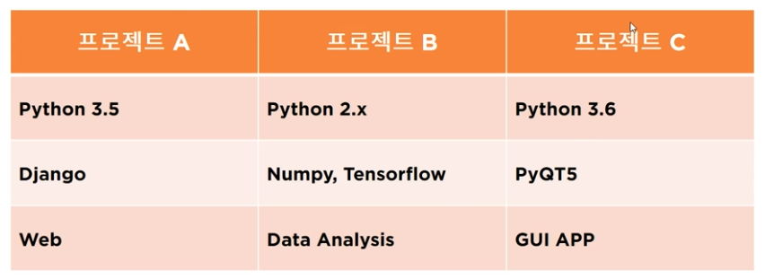

# 제로베이스 알고리즘 자료구조 51일 대비반 👨🏻‍💻

## 2021.10.12, day 01

### ① Mac OS 환경 설정 및 세팅

현재 경로에서 해당 bin(binary) 폴더로 이동

```bash
$ cd python_basic/bin
```

가상 서버 활성화

```bash
$ source ./activate
```

### ② print() 함수 배우기

- 가장 기본적인 Output(출력) 함수
- 기본 출력
- Separator, End 옵션 사용
- Format 형식 출력
- Escape Code 사용법

### print 함수 특징

**'', "" 를 구분하지 않는다**

```python
print('hello world!')
print("hello world!")
print("""hello world!""")
print('''hello world!''')
```

**Separator 옵션을 통해 입력한 문자열을 합칠 수 있다**

[Array.prototype.join() 🔥](https://developer.mozilla.org/ko/docs/Web/JavaScript/Reference/Global_Objects/Array/join) 과 같은 기능을 한다

```python
print('T', 'E', 'S', 'T')
print('T', 'E', 'S', 'T', sep='')
print('2019', '02', '19')
print('2019', '02', '19', sep='-')
print('niceman', 'google.com', sep='@')
```

**end 옵션을 사용 (끝을 내지 않겠다)**

end 옵션을 통해 각 줄별로 입력한 문자열을 이어줄 수 있다

```python
print('Welcome To', end=' ')
print('the black parade', end=' ')
print('piano notes')
```

## 2021.10.13, day 02

### ① print() 함수 배우기 2

- Format 형식 출력
- Escape Code 사용법

```py
# format 사용 [], {}, ()
print('{} and {}'.format('You', 'Me'))
```

```py
# index처럼 0 , 1 각 자리에 위치한 문자열을 매핑(할당)한다 >> You and Me and You
print('{0} and {1} and {0}'.format('You', 'Me'))
```

```py
# 매개변수에 값을 넣어주는 형태로 더욱 직관적으로 사용할 수 있다. >> You and Me
print("{a} are {b}".format(a='You', b='Me'))
```

```py
# format 함수를 쓰고 싶지 않고, 문자열 또는 정수, 실수를 나타내고 싶다면? 아래와 같은 방법으로 사용 가능하다
# %s: 문자, %d: 정수, %f: 실수

print("%s's favorite number is %d" % ('junhee', 7))
```

```py
# %와 문자 또는 숫자를 나타내는 [ s, d, f ] 사이에 숫자를 넣으면, 최대 자릿수를 정해줄 수 있다
print("Test1: %5d, Price: %4.2f" % (776, 6534.123))
print("Test1: {0: 5d}, Price: {1: 4.2f}".format(776, 6534.123))
print("Test1: {a: 5d}, Price: {b: 4.2f}".format(a=776, b=6534.123))
```

```py
# print() 시에 'you'를 표현하고 싶은 경우 쌍이 맞거나, 이스케이프 코드를 사용할 수 있다
print("'You'")
print('\'You\'')
print('"You"')
print("""'You'""")
print('\\yout\\\n') # 다르다
print('test')
print('\t tab 2')
```

### Escape Code

```py
# 참고 : Escape 코드

"""
\n : 개행
\t : 탭
\\ : 문자
\' : 문자
\" : 문자
\r : 캐리지 리턴
\f : 폼 피드
\a : 벨 소리
\b : 백 스페이스
\000 : 널 문자
"""
```

### ② 파이썬 구성요소 기초 학습

- 인코딩
- 변수
- 조건문
- 함수, 클래스, 인스턴스(객체)
- 정보 출력

```py
# import this
import sys

# 파이썬 기본 인코딩
print('입력:', sys.stdin.encoding)
print('출력:', sys.stdout.encoding)

# 출력문
print('My name is Junhee Lee')

# 변수 선언
MyName = 'Junhee'

print('Hello', MyName)

# 조건문
if MyName == 'Junhee':
    print('OK,', MyName, 'is right veriable')  # indent, 들여쓰기

# 반복문

for i in range(1, 10):
    for j in range(1, 10):
        print('%d * %d = ' % (i, j), i * j)


# 변수 선언(한글), 가능하지만 쓰지 않는 것을 추천
이름 = '준희'

# 출력
print('Hello', 이름)

# 함수 선언


def 인사(a):
    print('안녕하세요.', a, '님 반갑습니다!')


def greeting():
    print('Hello!')


# 함수 호출
인사('준희')
greeting()

# 클래스


class Cookie:
    pass


# 객체 생성
cookie = Cookie()

# 정보 값 출력
# id, dir은 사용자 정의 함수가 아닌 제공되는 빌트인 메서드이다
print(id(cookie))
print(dir(cookie))
```

### ③ 파이썬 가상환경

별개의 가상환경을 사용한다면 해당 가상 환경을 통해서 여러개의 다양한 버전의 파이썬과 모듈을 사용하더라도, 효과적으로 관리가 가능해진다



### 파이썬 가상환경 명령어 기초

- 가상환경 생성
- 가상환경 실행 / 해제
- 패키지 설치 및 삭제
- 패키지 리스트 출력
- 패키지 검색

**① 가상환경 생성**

해당 환경의 상위 디렉토리 예를 들어 📁FastCampus/python_basic 이라는 경로에 가상환경을 설정하고 싶은 경우

FastCampus에서 아래와 같은 명령어를 통해 가상환경을 생성한다

```
// venv : virtual environment, 가상 환경을 의미한다
$ python3 -m venv python_basic
```

**② 가상황경 실행 / 해제**

후에 생성된 📁FastCampus/python_basic/bin 으로 접근한다

```
📁 bin (binary) 폴더 내부에 있는 파일이자 명령어인 activate를 실행한다

$ source ./activate
```

```
$ source ./deactivate
```

**③ 패키지 설치 및 삭제**

```
$ pip install simplejson

$ pip uninstall simplejson
```

**④ 패키지 리스트 출력**

```
$ pip list
```

**⑤ 패키지 검색**

```
$ pip search simplejson
```

pip search 시에 오류가 날 경우, 해당 사이트에서 직접 검색 후에 다운이 가능하다

```
https://pypi.org/
```

<details>
<summary>그 외의 다양한 명령어 보기</summary>

```python
'''
python -m venv 가상환경명
	Script\activate.bat
	Script\deactivate.bat
	pip 명령어 : search , install, uninstall, list, freeze, show
	pip install search simplejson , simple*
	pip install install simplejson
	pip install install simplejson==버전
	pip install --upgrade simplejson
	pip show simplejson
	pip show -f simplejson
	pip freeze > packages.txt
	pip freeze --all > packages.txt
	pip install -r packages.txt


	python -m venv /path/to/venv : 윈도우, 맥, 리눅스 동일

	윈도우 : Script
	맥 : bin

	윈도우

	activate.bat : 가상환경 진입
	deactivate.bat : 가상환경 해제

	맥
	source ./activate : 가상환경 진입
	source ./deactivate : 가상환경 해제

	command : code 실행
'''
```

</details>

## 2021.10.14, day 03

### python data type (파이썬 데이터 타입 종류)

- Boolean
- Numbers
- String
- Bytes
- Lists
- Tuples
- Sets
- Dictionaries

### Boolean

```py
v_bool = True  # False, 첫 문자는 대문자로 작성해야 한다

print(type(v_bool))
```

```
>>>
<class 'bool'>
```

### Numbers

```py
v_int = 7
v_float = 10.2

print(type(v_int))
print(type(v_float))
```

```
>>>
<class 'int'>
<class 'float'>
```

### String

```py
v_str= 'Goody Boy'

print(type(v_str))
```

```
>>>
<class 'str'>
```

### Bytes

### Lists

```py
v_list = [3, 5, 6] # 다른 언어(js)에서는 배열이라고도 한다

print(type(v_list))
```

```
>>>
<class 'list'>
```

### Tuples

```py
v_tuple = 3, 5, 7

print(type(v_tuple))
```

```
>>>
<class 'tuple'>
```

### Dictionaries

```py
v_dict = {
	"name": "Junhee",
	"age": 25
}

print(type(v_dict))
```

```
>>>
<class 'dict'>
```

### ① 파이썬 숫자형(Numbers) 및 연산자

- `+` : 더하기
- `-` : 빼기
- `*` : 곱하기
- `/` : 나누기
- `//` : 나누기 (몫)
- `%` : 나누기 (나머지)
- `**` : 지수연산 (제곱)
- 단항 연산자

### 파이썬 숫자형 및 연산자 사용하기

```py
i1 = 39
i2 = 939
big_int1 = 99999999999999999999999999999999999999
big_int2 = 77777777777777777777777777777777777777
f1 = 1.234
f2 = 3.784
f3 = .5  # 0.5
f4 = 10.  # 10.0

print()

print(i1*i2)
print(f1 ** f2)
print(f3+i2)  # 결과값이 실수기 때문에 자동으로 형변환이 된다!

print()

result = f3 + i2
print(result, type(result))

# float 과 int를 연산할 때

a = 5.
b = 4
c = 10

print(type(a), type(b))
result2 = a+b
print(result2)

# 형 변환
# int, float, boolean, complex(복소수)

print(int(result2))  # float > int
print(float(c))  # int > float
print(complex(3))
print(int(True))  # 1로 변환
print(int(False))  # 0으로 변환
print(int('3'), type(int('3')))  # 문자열을 정수로 변환

y = 100
print('before y:', y)
y += 100

print('after y:', y)

# 수치 연산 함수

print('abs:', abs(-7))  # 절대값 absolute
n, m = divmod(100, 8)  # 몫은 n으로 나머지는 m으로 보내주는 함수
print(n, m)

# math 모듈이 제공하는 정적 메서드
print(math.ceil(5.1))  # 올림
print(math.floor(3.74))  # 버림
print(math.pi)  # 파이값 출력
```

### ② 파이썬 문자형 관련 연산자

- 문자열 생성, 길이
- 이스케이프 문자
- 문자열 연산
- 문자열 형 변환
- 문자열 함수
- 문자열 슬라이싱

### 문자열 생성, 길이

```py
str1 = "I'm a boy"
str2 = 'Nice man'
str3 = ''
str4 = str('')

print(len(str1), len(str2), len(str3), len(str4))
```

### 이스케이프 문자

```py
escape_str1 = "Do you have a \"big collection?\""
escape_str2 = 'Do you have a "big collection?"'
escape_str3 = 'Tab\tTab\tTab'

print(escape_str1)
print(escape_str2)
print(escape_str3)
```

#### Raw String

```py
# Raw String: r'' / r"" 작은 따옴표 또는 큰 따옴표 내부에 있는 이스케이프 처리는 이스케이프 처리가 되지 않고 그대로 출력된다

raw_s1 = r'C:\Programs\Test\Bin'
raw_s2 = r"\\a\\a"

print(raw_s1)
print(raw_s2)
```

#### 멀티라인

```py
# 멀티라인: 변수 선언 이후에 '\' 기호가 나온다면 문자열을 enter키를 포함하여 다음줄에 나온다는 것을 의미한다
multi = \
    """
문자열

멀티라인

테스트
"""
print(multi)
```

### 문자열 연산

```py
# 문자열 연산
str_o1 = '*'
str_o2 = 'abc'
str_o3 = 'def'
str_o4 = 'NiceMan'

print(str_o1 * 10)
print(str_o2 + str_o3)
print(str_o1 * 3)

# 한쪽만 문자열일 경우에는 * 연산자를 만나 형변환을 하지만 * 연산자의 좌항과 우항이 모두 문자열일 경우에는 에러가 난다

# print('a' * 'a') 좌항 우항 모두 문자열
# print(str_o1 * '3') 좌항 우항 모두 문자열 > TypeError: can't multiply sequence by non-int of type 'str'
```

#### in 연산자

```py
print('a' in str_o4)  # True, str_o4 안에 'a' 라는 문자열이 있니?
print('m' in str_o4)  # False, 대소문자를 구분한다
print('m' not in str_o4)  # True, str_o4 안에 'm' 이라는 문자열이 없니?
```

### 문자열 형 변환

```py
print(str(77))  # 숫자를 str()로 하여금 문자열로 변환함
print(str(77) + 'a')  # 결론적으로 문자 + 문자가 가능하게 됨
print(str(10.4))
```

### 문자열 함수

```py
a = 'niceman'
b = 'orange'

print(a.islower())  # a 문자열이 소문자로 되어 있니?
print(a.endswith('n'))  # a 문자열의 끝 글자가 n으로 끝나니?
print(a.capitalize())  # Niceman > 첫 글자만 대문자로 변경
print(a.replace('nice', 'holy'))  # 첫 번째 파라미터에 들어온 문자열을 두 번째 파라미터에 들어온 문자열로 대체

# 리스트 함수

print(list(b))  # b 문자열을 리스트 형으로 변환 ['o', 'r', 'a', 'n', 'g', 'e']
print(list(reversed(b)))  # b 문자열을 리스트 형으로 변환한 후 뒤집음(reversed)
```

### 문자열 슬라이싱

문자열의 범위를 지정한다 (일부분을 추출한다)

```py
a = '01234567'

print(a[0:3])  # 문자열 a의 0번째 인덱스부터 3번째 인덱스 전까지 (n-1) 까지 나와라 >>> 012
print(a[0:4])  # >>> 0123
print(a[0:len(a)])  # 0부터 문자열 a의 길이 (7) 전까지 나와라
print(a[:4])  # 처음부터 4번째 인덱스 전까지 (n-1) 까지 나와라 >>> 0123
print(a[:])  # 전체 다 나와라
print(a[0:len(a):2])  # 0부터 끝까지 나오는데, 2만큼 건너뛰고 나와라 >> 0246
print(a[0:-2])  # 0부터 (뒤에서부터 -2) 전까지 012345
print(a[::-1])  # 거꾸로 다 나와라 76543210
print(a[::2])  # 0부터 끝까지 2만큼 건너뛰고 나와라 >> 0246
```

### 파이썬 자료구조(List, Tuple)

- 리스트 특징
- 튜플 특징
- 인덱싱
- 슬라이싱
- 삽입, 삭제, 함수 사용

### 리스트 특징

- 순서 o
- 중복 o
- 수정 o
- 삭제 o

### 리스트 선언

```py
a = []
b = list()
c = [1, 2, 3, 4]
d = [10, 100, 'Pen', 'Banana', 'Orange']
e = [10, 100, ['Pen', 'Banana', 'Orange']]
```

### 리스트 인덱싱

Banana를 추출하고 싶을 때

```py
print(d[3])  # 인덱스 3에 위치한 요소 추출
print(d[-2])  # 뒤에서부터 -2번째 요소 추출
print(e[2][1])  # 2차원 베열 내부에서 인덱스 1에 위치한 요소 추출
print(e[2][-2])  # 2차원 배열 내부에서 뒤에서부터 -2번째 요소 추출
```

### 리스트 슬라이싱

```py
# 범위를 지정한다 (일부분을 추출한다)
print(d[0:3])  # 인덱스 0 부터 인덱스 3 전까지 (2 까지)
print(e[2][1:3])  # 2차원 배열의 인덱스 1부터 3전까지 (2까지)
print(e[2][1:len(e[2])])  # 2차원 배열의 인덱스 1부터 e[2]의 길이 전까지 >>> len(e[2]) = 3
```

## 2021.10.15, day 04

### 리스트 연산

```py
print(c + d)
print(c*3)
# print(c[0] + 'hi') error, number + string의 식은 자동 형변환이 불가능하다
print(str(c[0]) + 'hi')
```

### 리스트 수정, 삭제

```py
c[0] = 77
print(c)

# 슬라이싱 후 대입 기존 리스트의 구간보다 대입하는 구간의 길이가 길다면 리스트의 길이가 늘어난다 (삽입으로 인해)
c[1:2] = [100, 1000, 10000]
print(c)  # [77, 100, 1000, 10000, 3, 4]


c[1] = ['a', 'b', 'c']
print(c)  # [77, ['a', 'b', 'c'], 1000, 10000, 3, 4]

del c[1]
print(c)  # [77, 1000, 10000, 3, 4]

del c[-1]
print(c)  # [77, 1000, 10000, 3]
```

### 리스트 함수

```py
y = [5, 2, 3, 1, 4]
print(y)

y.append(6)  # push와 같음, 배열의 끝 부분에 해당 요소를 추가한다
print(y)  # [5, 2, 3, 1, 4, 6]

y.sort()  # 오름차 순으로 배열을 정리한다
print(y)  # [1,2,3,4,5,6]

y.reverse()  # 배열을 뒤집어서 반환한다
print(y)  # [6,5,4,3,2,1]

y.insert(2, 7)  # 배열에 인덱스 n 뒤에 m 요소를 삽입한다. (n, m) 인덱스 n 자리에 m 요소를 삽입한다
print(y)  # [6, 5, 7, 4, 3, 2, 1]

y.remove(2)  # 배열에서 요소 m 이 있다면 해당 요소를 삭제한다
print(y)  # [6, 5, 7, 4, 3, 1]

y.pop()  # 배열의 맨 마지막 요소를 제거한다
print(y)  # [6, 5, 7, 4, 3]

ex = [88, 77]
y.extend(ex)  # 배열의 맨 마지막에 해당 변수를 넣어 확장한다
print(y)  # [6, 5, 7, 4, 3, 88, 77]

# 추가(삽입) : append, insert, extend
# 삭제 : del, remove, pop
```

### 튜플 특징

- 순서 o
- 중복 o
- 수정 x
- 삭제 x

### 튜플 선언

튜플 선언 (리스트와 달리 소괄호로 선언한다)

```py
a = ()
b = (1,)
c = (1, 2, 3, 4)
d = (10, 100, ('a', 'b', 'c'))
```

### 튜플 참조 (인덱싱)

```py
# 튜플 참조 리스트와 같이 [ ] 대괄호를 사용하여 참조한다

print(c[2])
print(c[3])
print(d[2][2])

# del c[2]: 'tuple' object doesn't support item deletion >> 튜플은 수정과 삭제가 되지 않는다
```

### 튜플 슬라이싱

```py
print(d[2:])
print(d[2][0:2])

# 삽입이 가능하나, 수정, 삭제가 불가능하므로 신중히 진행해야 한다
print(c+d)
print(c*3)
```

### 튜플 함수

```py
z = (5, 2, 1, 3, 4, 1)

print(z)
print(3 in z)
print(6 not in z)
print(z.index(3))  # 튜플에서 해당 요소가 위치하고 있는 인덱스를 반환합니다
print(z.count(1))  # 튜플에서 해당 요소의 개수를 반환합니다
```

### 파이썬 자료구조(Dictonary, Set)

- 딕셔너리 특징
- 딕셔너리 추가
- 집합 특징
- 집합 자료형 함수
- 자료형 변환

### 딕셔너리 (Dictonary)

### 딕셔너리 특징

- 순서 x
- 중복 x
- 수정 o
- 삭제 o

딕셔너리는 Key, Value (Json) 로 이루어진 형식이다

#### 딕셔너리 선언

```py
a = {
    'name': 'junhee',
    'phone': '010-7777-7777',
    'birth': 970328
}

b = {
    0: 'Hello Python',
    1: 'Hello Coding'
}

c = {
    'arr': [1, 2, 3, 4, 5],
    'tuple': (1, 2, 3, 4, 5)
}

print(type(a))  # >>> <class 'dict'>
```

### 딕셔너리 출력

```py
# 직접 접근하기
print(a['name'])

# get을 통해 접근하기
# 있을 경우 직접 접근과 동일하게 출력
print(a.get('name'))

# 없을 경우에는 Error 대신 None 출력 >>> 따라서 안전하게 조회할 수 있다 (에러 핸들링이 가능하다)
print(a.get('address'))

print(c['arr'][1:3])  # [2, 3]
```

### 딕셔너리 추가

```py

# 딕셔너리 추가
a['address'] = 'Seoul'
print(a)
# {'name': 'junhee', 'phone': '010-7777-7777', 'birth': 970328, 'address': 'Seoul'}


a['rank'] = [1, 3, 4]
a['rank2'] = (1, 2, 3, 4)

print(a)
# {'name': 'junhee', 'phone': '010-7777-7777', 'birth': 970328, 'address': 'Seoul', 'rank': [1, 3, 4], 'rank2': (1, 2, 3, 4)}

print()

# keys, values, items

# key

# 딕셔너리 a의 key 값만 가져오고 싶을 때
print(a.keys())
# >>> dict_keys(['name', 'phone', 'birth', 'address', 'rank', 'rank2'])

# 배열의 형태가 아니기 때문에 인덱싱으로 접근할 수 없다
# print(a.keys()[0])  # Error: 'dict_keys' object is not subscriptable

# 따라서 배열로 형변환을 한다면 그 후에 접근이 가능해진다
print(list(a.keys())[0])
print(list(a.keys()))

print()

# value

print(a.values())
print(list(a.values()))
print(list(a.values())[:len(list(a.values()))])

print()

# item

# 배열안에 각 key, value 의 쌍으로 이루어진 튜플이 들어있는 형식으로 반환된다

print(a.items())
print(list(a.items()))

# [
#     ('name', 'junhee'),
#     ('phone', '010-7777-7777'),
#     ('birth', 970328),
#     ('address', 'Seoul'),
#     ('rank', [1, 3, 4]),
#     ('rank2', (1, 2, 3, 4))
# ]
```

### 집합 특징

- 순서 x
- 중복 x
- 추가 o
- 제거 o

### 집합 선언

```py
# 집합 선언

a = set()
b = set([1, 2, 3, 4])
c = set([1, 4, 5, 6, 6])

print(type(a)) # >>> <class 'set'>
print(c)  # 중복을 허용하지 않기 때문에 알아서 제거되어 나옵니다  {1, 4, 5, 6}

# 중복을 제거한 상태에서 집합 또는 튜플로 변환하여 주로 사용한다

t = tuple(b)
print(t)
l = list(b)
print(l)
```

### 집합 자료형 함수

```py
s1 = set([1, 2, 3, 4, 5, 6])
s2 = set([4, 5, 6, 7, 8, 9])

# 교집합

print(s1.intersection(s2))
print(s1 & s2)

# {4, 5, 6}

print()

# 합집합

print(s1.union(s2))
print(s1 | s2)

# {1, 2, 3, 4, 5, 6, 7, 8, 9}

print()

# 차집합

print(s1.difference(s2))
print(s1 - s2)

# {1, 2, 3}

print()

# 집합(Sets) 추가 & 제거

s3 = set([7, 8, 10, 15])

print(s3)

# 추가

s3.add(18)
print(s3)

# 제거

s3.remove(15)
print(s3)

print(type(s3))

# >>> <class 'set'>
```

### 퀴즈 개인 답안

```py
# Section04-5

# 1. 아래 문자열의 길이를 구해보세요.
q1 = "dk2jd923i1jdk2jd93jfd92jd918943jfd8923"

print("1:", len(q1))

# 2. print 함수를 사용해서 아래와 같이 출력해보세요.
#    apple;orange;banana;lemon

print("2:", 'apple;orange;banana;lemon')

# 3. 화면에 * 기호 100개를 표시하세요.

print("3:", '*' * 100)

# 4. 문자열 "30" 을 각각 정수형, 실수형, 복소수형, 문자형으로 변환해보세요.

q4 = '30'
int_q4 = int(q4)
float_q4 = float(q4)
complex_q4 = complex(q4)

print(type(int(int_q4)), int_q4)
print(type(float(float_q4)), float_q4)
print(type(complex(complex_q4)), complex_q4)
print(type(q4), q4)

# 5. 다음 문자열 "Niceman" 에서 "man" 문자열만 추출해보세요.

q5 = 'Niceman'

print(q5[4:len(q5)])
print("5:", q5.replace('Nice', ''))

# 6. 다음 문자열을 거꾸로 출력해보세요. : "Strawberry"

sb = 'Strawberry'
list_sb = list(sb)
list_sb.reverse()
# print(list_sb)
print("6:", ''.join(list_sb))

# 7. 다음 문자열에서 '-'를 제거 후 출력하세요. : "010-7777-9999"

phone = "010-7777-9999"
answer = []

for i in range(0, len(phone)):
    if(phone[i] != '-'):
        answer.append(phone[i])

print("7:", ''.join(answer))


# 8. 다음 문자열(URL)에서 "http://" 부분을 제거 후 출력하세요. : "http://daum.net"

url = "http://daum.net"

print('8:', url.replace('http://', ''))


# 9. 다음 문자열을 모두 대문자, 소문자로 각각 출력해보세요. : "NiceMan"

m = "NicemMan"
answer = []

for i in range(0, len(m)):
    if(m[i].islower()):
        answer.append(m[i].upper())
    else:
        answer.append(m[i].lower())

print("9:", ''.join(answer))

# 10. 다음 문자열을 슬라이싱을 이용해서 "cde"만 출력하세요. : "abcdefghijklmn"

print("10:", 'abcdefghijklmn'[2:5])


# 11. 다음 리스트에서 "Apple" 항목만 삭제하세요. : ["Banana", "Apple", "Orange"]

Arrlist = ["Banana", "Apple", "Orange"]

del Arrlist[1]

print("11:", Arrlist)


# 12. 다음 튜플을 리스트로 변환하세요. : (1,2,3,4)

t = (1, 2, 3, 4)
print("12:", list(t))


# 13. 다음 항목을 딕셔너리(dict)으로 선언해보세요. : <성인 - 100000 , 청소년 - 70000 , 아동 - 30000>

dictObj = {
    "성인": -100000,
    "청소년": -70000,
    "아동": -30000
}

print("13:", type(dictObj), dictObj)

# 14. 13번 에서 선언한 dict 항목에 <소아 - 0> 항목을 추가해보세요.

dictObj['소아'] = -0

print("14:", dictObj)

# 15. 13번에서 선언한 딕셔너리(dict)에서 Key 항목만 출력해보세요.

print("15:", dictObj.keys())

# 16. 13번에서 선언한 딕셔너리(dict)에서 value 항목만 출력해보세요.

print("16:", dictObj.values())


# *** 결과 값만 정확하게 출력되면 됩니다. ^^* 고생하셨습니다. ***
```

### 느낀점

파이썬 코드 작성시에 변수를 빌트인 객체와 같이 줘도 문제가 없어서 계속 str, list, obj 이런식으로 변수명을 선언했다가 출력할 때 에러가 생겼다

자율성이 부여되는 만큼 나만의 규칙을 정하고 변수명을 지어야겠다!

`#6, #7, #9` 번은 이런식으로 풀라고 내주신 문제가 아닌 것 같은데 기존 js 문제를 풀던 생각대로 풀다보니 이렇게 풀게 되었다

정답은 같겠지만, 선생님의 풀이를 듣고 만약에 다른 것이 있다면 추가적으로 공부해야 겠다

<details>
<summary>선생님 풀이 보기</summary>

```py
# 1. 아래 문자열의 길이를 구해보세요.
import re
q1 = "dk2jd923i1jdk2jd93jfd92jd918943jfd8923"

print("1. ", len(q1))

# 2. print 함수를 사용해서 아래와 같이 출력해보세요.
# apple;orange;banana;lemon

print("2. ", "apple;orange;banana;lemon")

# 3. 화면에 * 기호 100개를 표시하세요.

print('3. ', '*' * 100)

# 4. 문자열 "30" 을 각각 정수형, 실수형, 복소수형, 문자형으로 변환해보세요.

print('4. ', int('30'))
print('4. ', float('30'))
print('4. ', complex('30'))
print('4. ', str(30))

# 5. 다음 문자열 "Niceman" 에서 "man" 문자열만 추출해보세요.

q5 = 'Niceman'
q5_idx = q5.index('man')

print('5. ', q5[q5_idx:])
print('5. ', q5[q5_idx: q5_idx+3])
print("5. ", q5[4:7])

# 6. 다음 문자열을 거꾸로 출력해보세요. : "Strawberry" 🔥 까먹었던 것

q6 = "Strawberry"

print('6. ', ''.join(list(reversed(q6))))
print('6. ', q6[::-1])  # 🔥 까먹었던 것

# 7. 다음 문자열에서 '-'를 제거 후 출력하세요. : "010-7777-9999" # 🔥 까먹었던 것

q7 = "010-7777-9999"

print("7. ", q7[0:3] + q7[4:8] + q7[9:])  # 🔥 까먹었던 것
print("7. ", q7[0:3] + q7[4:8] + q7[9:13])

# 정규 표현식 (regex, regular expression)

# import re

print("7. ", re.sub('[^0-9]', '', q7))

# 8. 다음 문자열(URL)에서 "http://" 부분을 제거 후 출력하세요. : "http://daum.net"

q8 = "http://daum.net"

print("8. ", q8[7:])


# 9. 다음 문자열을 모두 대문자, 소문자로 각각 출력해보세요. : "NiceMan"
# 🔥 대문자/ 소문자를 대문자를 소문자로 소문자를 대문자로 라고 잘못 이해함

print("9. ", "Niceman".upper())
print("9. ", "Niceman".lower())

# 10. 다음 문자열을 슬라이싱을 이용해서 "cde"만 출력하세요. : "abcdefghijklmn"

q10 = "abcdefghijklmn"

print("10. ", q10[2:5])


# 11. 다음 리스트에서 "Apple" 항목만 삭제하세요. : ["Banana", "Apple", "Orange"] 🔥 remove 함수 사용

q11 = ["Banana", "Apple", "Orange"]

q11.remove("Apple")  # 🔥 remove 함수 사용

print("11. ", q11)


# 12. 다음 튜플을 리스트로 변환하세요. : (1,2,3,4)

q12 = (1, 2, 3, 4)
print("12. ", list(q12))

# 13. 다음 항목을 딕셔너리(dict)으로 선언해보세요. : <성인 - 100000 , 청소년 - 70000 , 아동 - 30000>

q13_dict = {
    '성인': 100000,
    '청소년': 70000,
    '아동': 30000
}

q13_dict_2 = {}
q13_dict_2['성인'] = 100000
q13_dict_2['청소년'] = 70000
q13_dict_2['아동'] = 30000

print("13. ", q13_dict)
print("13. ", q13_dict_2)


# 14. 13번 에서 선언한 dict 항목에 <소아 - 0> 항목을 추가해보세요.

q13_dict['소아'] = 0

print("14. ", q13_dict)

# 15. 13번에서 선언한 딕셔너리(dict)에서 Key 항목만 출력해보세요.

print("15. ", q13_dict.keys())
print("15. ", list(q13_dict.keys()))

# 16. 13번에서 선언한 딕셔너리(dict)에서 value 항목만 출력해보세요.

print("16. ", q13_dict.values())
print("16. ", list(q13_dict.values()))

# *** 결과 값만 정확하게 출력되면 됩니다. ^^* 고생하셨습니다. ***

```

</details>

## 2021.10.16, day 05

### IF(조건문)

- 조건문 기본 형식
- 관계 연산자 실습(>, >=, <, <=, ==, !=)
- 논리 연산자 실습(and, or, not)
- 다중 조건문 (if, elif, else)
- 중첩 조건문

### 조건문 기본 형식

```py
# 예1
if True:
    print('참 입니다!')

# 예2
if False:
    print('거짓 입니다')
else:
    print('참 입니다!')
```

### 관계 연산자 실습

```py
# 관계연산자
# >, >=, <, <=, ==, !=

a = 10
b = 0

print(a == b)
print(a != b)
print(a > b)
print(a >= b)
print(a < b)
print(a <= b)

# 참 거짓 종류 (True, False)

# 참 : '내용', [내용], (내용), {내용}, 1 >>> 내용이 있는 자료형
# 거짓 : '', [], (), {}, 0 >>> 내용이 없는 자료형

city = ''

if(city):
    print(city)
else:
    print('city가 빈 문자열입니다')
```

### 논리 연산자 실습

```py
# and, or, not 문자 그대로 사용

a = 100
b = 60
c = 15

print('and: ', a > b and b > c)
print('or: ', a > b or c > b)  # 둘 중 하나만 만족하더라도 true
print('not:', not a > b)
print('"not False:" ', not False)
print('"Ænot True:" ', not True)

print()
```

### 산술, 관계, 논리 연산자

```py
# 산술 > 관계 > 논리 순서로 적용 (우선순위)

print('ex1 :', 5+10 > 0 and 7 + 3 == 10)

score1 = 90
score2 = 'A'


if score1 >= 90 and score2 == 'A':
    print('합격')
else:
    print('불합격입니다')
```

### 다중 조건문

```py
num = 2

if num >= 90:
    print("num 등급 A", num)
elif num >= 80:
    print("num 등급 B", num)
elif num >= 70:
    print("num 등급 C", num)
else:
    print('num 등급 D, 탈락', num)

print()
```

### 중첩 조건문

```py
# 중첩 조건문

age = 27
height = 175

if age >= 20:
    if height >= 170:
        print('A지망 지원 가능')
    elif height >= 160:
        print("B지망 지원 가능")
    else:
        print("지원 불가")
else:
    print("20세 이상 지원 가능")

```

### For, while (반복문)

- 파이썬 코딩의 핵심
- 시퀀스 타입 반복
- Continue, Break
- For - else 구문
- 자료구조 변환

### 기본 반복문 : for, while

### while 문 >>> 조건이 true가 될 때까지 반복

```py
# while 문 v1 < 11 때까지 반복

v1 = 1

while v1 < 11:
    print('v1 is :', v1)
    v1 += 1
```

### for 문

```py
# for 문 0 - 9까지 반복
# range(n) 함수에 매개변수가 1개라면 0부터 n-1 까지를 의미한다

for v2 in range(10):
    print('v2 is :', v2)
    v2 += 1

print()

# for 문 1 - 10까지 반복

for v3 in range(1, 11):
    print('v3 is :', v3)
    v3 += 1
```

### 시퀀스 타입 반복

```py
# 시퀀스(순서가 있는) 자료형 반복
# 문자열, 리스트, 튜플, 집합, 딕셔너리 (집합과 딕셔너리는 순서가 없지만 이렇게 순회 가능한 타입들은 반복이 가능하다는 의미이다)
# iterable 리턴 함수: range, reversed, enumerate, filter, map, zip

# 리스트

names = ["Kim", "Park", "cho", "Choi", "Yoo"]

for i in names:
    print("Yo are: ", i)

# 문자열

word = "dreams"

for string in word:
    print("Word : ", string)

# 딕셔너리

my_info = {
    "name": "Kim",
    "age": 13,
    "city": "Seoul"
}

# 기본 값은 key를 순회한다

for key in my_info:
    print("my_info :", key)

# 값을 순회

for key in my_info.values():
    print("my_info :", key)

# 키를 순회

for key in my_info.keys():
    print("my_info :", key)

# 아이템 (key, value)를 순회

for key, value in my_info.items():
    print("my_info :", key, value)

name = "KennRY"

for n in name:
    if n.isupper():
        print(n.lower())
    else:
        print(n.upper())
```

### break 문

```py
# break

numbers = [14, 3, 4, 7, 10, 24, 17, 2, 33, 15, 34, 46, 48]

for num in numbers:
    if num == 33:
        print("Found: 33!")
        break
    else:
        print("not found: 33...")
```

### break문, for - else 구문

```py
# for 문 안에서 truthy한 값을 만나 break가 작동하지 않은 경우에는 else문에서 최종적으로 print 된다

for num in numbers:
    if num == 33:
        print("Found: 33!")
        break
    else:
        print("not found: 33...")
else:
    print("Not found 33......🥲")

print()

for num in numbers:
    if num == 40:
        print("Found: 40!")
        break
    else:
        print("not found: 40...")
else:
    print("Not found 40......🥲")

print()
```

### continue 문

```py
# continue
# continue 문의 조건에 부합할 경우 continue 밑의 코드를 실행하지 않고 다음 조건으로 이동

lt = ["1", 2, 5, True, 4.3, complex(4)]

for v in lt:
    if type(v) is float:
        continue
    print('float이 아닙니다...', type(v), v)

print()
```

### 자료구조 변환

```py
name = "Niceman"
print(reversed(name))
print(list(reversed(name)))
print(tuple(reversed(name)))
print(set(reversed(name)))
```

### 나의 문제풀이

```py
# 1 ~ 5 문제 if 구문 사용
# 1. 아래 딕셔너리에서 '가을'에 해당하는 과일을 출력하세요.
q1 = {"봄": "딸기", "여름": "토마토", "가을": "사과"}

if '가을' in q1.keys():
    print('q1:', q1['가을'])


# 2. 아래 딕셔너리에서 '사과'가 포함되었는지 확인하세요.
q2 = {"봄": "딸기", "여름": "토마토", "가을": "사과"}

if '사과' in q2.values():
    print('q2:', '사과' in q2.values())

# 3. 다음 점수 구간에 맞게 학점을 출력하세요.
# 81 ~ 100 : A학점
# 61 ~ 80 :  B학점
# 41 ~ 60 :  C학점
# 21 ~ 40 :  D학점
#  0 ~ 20 :  E학점
q3 = 90

if (q3 > 80):
    print('q3:', 'A 학점')
elif (q3 > 60):
    print('q3:', 'B 학점')
elif (q3 > 40):
    print('q3:', 'C 학점')
elif (q3 > 20):
    print('q3:', 'D 학점')
else:
    print('q3:', 'E 학점')

# 4. 다음 세 개의 숫자 중 가장 큰수를 출력하세요.(if문 사용) : 12, 6, 18

a = 12
b = 6
c = 18
max = 0

if (a > b):
    max = a
elif (a < b):
    max = b

if(c > max):
    max = c
    print('q4:', 'max', max)


# 5. 다음 주민등록 번호에서 7자리 숫자를 사용해서 남자, 여자를 판별하세요. (1,3 : 남자, 2,4 : 여자)

q5 = '9703281'

if len(q5) != 7:
    print('잘못 입력한 주민번호입니다 다시 입력해주세요')

if(q5[6] == '1'):
    print('남자입니다')
elif(q5[6] == '3'):
    print('남자입니다')
elif(q5[6] == '2'):
    print('여자입니다')
elif(q5[6] == '4'):
    print('여자입니다')
else:
    print('잘못된 주민번호입니다')

# 6 ~ 10 반복문 사용(while 또는 for)

# 6. 다음 리스트 중에서 '정' 글자를 제외하고 출력하세요.
q6 = ["갑", "을", "병", "정"]
list = []
for v in q6:
    if(v == '정'):
        continue
    list.append(v)

print('q6:', list)

# 7. 1부터 100까지 자연수 중 '홀수'만 한 라인으로 출력 하세요.

q7 = []

for v in range(1, 101, 2):
    q7.append(v)

print('q7:', q7)

# 8. 아래 리스트 항목 중에서 5글자 이상의 단어만 출력하세요.
q8 = ["nice", "study", "python", "anaconda", "!"]
list = []
for v in q8:
    if(len(v) >= 5):
        list.append(v)

print('q8:', list)

# 9. 아래 리스트 항목 중에서 소문자만 출력하세요.
q9 = ["A", "b", "c", "D", "e", "F", "G", "h"]
list = []
for v in q9:
    if v.islower():
        list.append(v)

print('q9:', list)


# 10. 아래 리스트 항목 중에서 소문자는 대문자로 대문자는 소문자로 출력하세요.
q10 = ["A", "b", "c", "D", "e", "F", "G", "h"]
list = []

for v in q10:
    if v.isupper():
        list.append(v)
print('q10:', list)

```

### 느낀점

`q4, q5`가 js의 lint와 달라져서 값이 다르게 나온다

아직 파이썬의 기본 문법을 제대로 숙달하지 않은 느낌이다

`q5`는 input을 받을 때 숫자를 입력하더라도 e.target.value의 값이 문자열로 넘어오게 된다

이를 바로 넘겨받은 string 값을 바로 정수형 int로 형변환하고 싶었는데 의도대로 잘 되지 않았다 강의를 보고 해당 부분만 어떻게 처리하는지 봐야할 것 같다

`end = ''` 문법을 잘 사용하지 않았던 것 같다.

문자열을 한 줄로 나열할 때 굳이 리스트로 만들지 않더라도 end 옵션을 통해 한줄로 나열할 수 있음을 명심하자

## 2021.10.17, day 06

### 리스트 컴프리헨션

```py
# 리스트를 쉽게 만들게 해주는 것

# 기존

numbers = []

for n in range(1, 101):
    numbers.append(n)

print(numbers)

print()

```

### 선언하기

```py
# 선언하는 법

# x = [x for x in range(범위)]
# x = [x for x in range(범위) if 조건문] >> 조건문이 true일 때 x로 append가 된다
# x = [x for x in range(범위) if 조건문 else 조건문] >>> 조건문이 false 일 때 적용할 것 적을 수 있다
```

```py
# 리스트 컴프리핸션

numbers2 = [x for x in range(1, 101)]
print(numbers2)

```

### 함수 정의 및 람다(lambda) 사용

- 함수 선언
- 함수 다양한 사용
- 다양한 반환 값
- \*args, \*\*kwargs
- 람다함수

### 함수 선언

```py
# 함수 정의 방법
# def 함수명(parameter):
#   code

# 함수 호출

# 함수명()
# 함수명(parameter)

# 함수 선언 위치 중요
```

### 함수 다양한 사용

```py
# 예제 1 반환문 없이 사용

def hello(world):
    print('Hello', world)


hello('준희!')
hello('Python!')
hello(7777)
```

```py
# 예제 2 (리턴 사용)


def hello_return(world):
    val = 'Hello' + str(world)
    return val


str = hello_return('Junhee')

print(str)
```

```py
# 예제 3 (다중 리턴)
def func_mul(x):
    y1 = x * 100
    y2 = x * 200
    y3 = x * 300
    return y1, y2, y3


val1, val2, val3 = func_mul(100)
print(val1, val2, val3)
```

### 다양한 반환 값

```py
# 예제 4 (데이터 타입 반환)
# 리스트 타입


def func_mul2(x):
    y1 = x * 100
    y2 = x * 200
    y3 = x * 300
    return [y1, y2, y3]


lt = func_mul2(100)
print(lt)

# 튜플 타입


def func_mul3(x):
    y1 = x * 100
    y2 = x * 200
    y3 = x * 300
    return (y1, y2, y3)


tp = func_mul3(100)
print(tp)
```

### \*args, \*\*kwargs

```py
# 예제 5
# *args (arguments), *kwargs (keyword arguments)

# *args >> 가변 (JS의 REST Parameter와 동일)
# 튜플의 형태로 넘어온다


def args_func(*args):
    # print(type(args))
    print(args)

# 따라서 반복문을 사용할 수도 있다


def args_func2(*args):
    for t in args:
        print(t)

# enumerable >>> 인덱스를 통해 인덱스와 요소를 열거


def args_func3(*args):
    # for i, v in enumerate(range(10)) 범위 설정도 가능
    for i, v in enumerate(args):
        print(i, v)


args_func('kim')
args_func('kim', 'lee')
args_func('kim', 'lee', 'park')

args_func2('kim', 'lee', 'park')

args_func3('kim', 'lee', 'park')

print()

# kwargs


def kwargs_func(**kwargs):
    print(kwargs)


def kwargs_func2(**kwargs):
    for k, v in kwargs.items():
        print(k, v)


kwargs_func(name1='Kim', name2='Park', name3='Lee')
kwargs_func2(name1='Kim', name2='Park', name3='Lee')

print()

# 전체 혼합


def example_mul(arg1, arg2, *args, **kwargs):
    print(arg1, arg2, args, kwargs)


example_mul(1, 2)  # 1 2 () {}
example_mul(1, 2, 3)  # 1 2 (3) {}
example_mul(1, 2, 3, 4, name1='kim', name2='lee')  # 1 2 (3, 4) {'name': 'kim'}

print()
```

### 중첩함수 (클로저)

```py
# 중첩함수(클로저)

def nested_func(num):
    def func_in_func(num):
        print('>>>', num)
    print('in func')
    func_in_func(num + 1000)


nested_func(1000)
```

### 힌트

```py
# 예제 6 힌트 (타입 설정 but, 타입이 다르더라도 에러를 발생시키지는 않는다)

def func_mul3(x: int) -> list:
    y1 = x * 100
    y2 = x * 200
    y3 = x * 300
    return [y1, y2, y3]


print(func_mul3(5))
print(func_mul3(6.0))
```

### 람다함수

```py
# 람다식 예제
# 람다식 : 메모리 절약, 가독성 향상, 코드 간결
# 함수는 객체 생성 -> 리소스(메모리) 할당
# 람다는 즉시 실행(Heap 초기화) -> 메모리 초기화

# 일반적인 함수 -> 변수 할당


def mul_10(num: int) -> int:
    return num * 10


var_func = mul_10
print(var_func)  # <function mul_10 at 0x10abb6830> 함수 선언시에 메모리에 이미 할당되어 있다
print(type(var_func))  # <class 'function'>

print(var_func(10))

# 람다식
# 불필요한 리턴문을 다 없앰, 메모리에 할당되지 않음

# lambda_mul_10= lambda num: num * 10


def lambda_mul_10(num): return num * 10


print('>>>', lambda_mul_10(10))


def func_final(x, y, func):
    print(x*y*func(10))


func_final(10, 10, lambda_mul_10)

print(func_final(10, 10, lambda x: x*1000))
```

### 클래스 선언 및 Self 의 이해

- 클래스 선언
- 클래스 네임스페이스 Self
- 클래스, 인스턴스 변수
- Self

### 클래스 선언

```py
# 선언
# class 클래스명:
#     함수
#     함수1
#     함수2

# 예제 1

# 첫글자가 대문자로 시작하는 것을 원칙으로 함
# 단어와 단어 사이에는 대문자로 구분

class UserInfo:
    # 속성(프로퍼티), 메서드
    # __init__ 을 통해 초기화를 헤야 한다
    def __init__(self, name):
        self.name = name

    def user_info_p(self):
        print("Name:", self.name)


user1 = UserInfo('Lee')
print('self.name:', user1.name)
user1.user_info_p()

print()

user2 = UserInfo('Park')
print('self.name:', user2.name)
user2.user_info_p()

# 각 인스턴스의 id를 볼 수 있음

print('id:', id(user1))
print('id:', id(user2))

print()

# 각 인스턴스의 딕셔너리형 구조를 볼 수 있음 { key: value } 형식

print(user1.__dict__)
print(user2.__dict__)
```

## 2021.10.19, day 07

### 클래스, 인스턴스, 네임스페이스

```py
# 클래스, 인스턴스 차이
# 클래스 형태로 코딩을 한뒤 변수화하여
# 인스턴스에 할당하고 메모리에 올려 이를 사용한다

# 네임스페이스 : 객체를 인스턴스화 할 때 저장된 공간, 모든 자료형은 자신만의 네임스페이스를 가진다
# 클래스 변수 : 직접 사용 가능 (js의 정적 메서드와 동일), 객체 보다 먼저 생성 , 해당 클래스를 사용하는 전체가 공유
# 인스턴스 변수 : 객체마다 별도로 존재, 인스턴스 생성 후에 사용, 각각이 개인적으로 가짐
```

### self의 이해

일반적으로 js에서의 this와 같은 의미로 쓰인다고 생각하면 될 것 같다

```py
# 예제 2
# self의 이해


class Parent:
    # self 인자가 없을 경우, 인스턴스 생성 시에 사용할 수 없다
    def function1():
        print('non self function called!')

    def function2(self):
        print(id(self))
        print('self function called!')


child = Parent()

# Parent.function1()
# >>> 인스턴스로 만들었을 경우 finction1() 메서드는 self 키워드가 없어 누구의 인스턴스인지 알 수 없다
# 따라서 self 가 없는 (자바스크립트에서의 정적 메서드) 클래스 메서드를 사용할 때는 클래스를 직접 호출하여 사용한다

Parent.function1()

child.function2()

print(id(child))

Parent.function2(child)
```

### 클래스 변수, 인스턴스 변수

- 클래스 변수는 self가 없다 (js의 정적 메서드와 동일)
- 인스턴스 변수는 self가 있다 (js의 this와 동일)

```py
# 예제 3
# 클래스 변수 (self x), 인스턴스 변수 (self o)


class WareHouse:
    # 클래스 변수
    stock_num = 0

    def __init__(self, name):
        self.name = name
        WareHouse.stock_num += 1

    def __del__(self):
        WareHouse.stock_num -= 1


user1 = WareHouse('kim')
user2 = WareHouse('park')
user3 = WareHouse('lee')

print(user1.__dict__)
print(user2.__dict__)
print(user3.__dict__)

print()

print(WareHouse.__dict__)
# ... 'stock_num': 3, 클래스 변수는 사용자 모두가 공유하기 때문에, init(초기화)한 멤버 수만큼 증가하여 3이 되었다

print()

print(user1.name)
print(user2.name)
print(user3.name)

print()

# 자기 네임 스페이스에 없다면 클래스 네임스페이스에서 찾는다
# 클래스 네임스페이스에도 없다면 에러를 발생시킨다

print(user1.stock_num)  # 3
print(user2.stock_num)  # 3
print(user3.stock_num)  # 3

print()

# user1을 지울 경우
# 공통 클래스 변수인 stock에 할당된 값도 줄어들 것이다

del user1

print(user2.stock_num)  # 2
print(user3.stock_num)  # 2

```

### 클래스 상속, 다중 상속

- 클래스 상속
- 클래스 상속 예제 코디
- 클래스 다중 상속

### 클래스 상속

```py
# 예제 1
# 상속 기본
# 슈퍼클래스(부모) 및 서브클래스(자식) -> 상속받을 경우 부모의 모든 속성, 메서드 사용 가능

# 라면 클래스를 만든다고 가정
# 속성(종류, 회사, 맛, 면 종류, 이름) : 부모


class Car:
  # 문자열로 무슨 클래스인지 적어주면 좋다
    """Parent Class"""

    def __init__(self, type, color):
        self.type = type
        self.color = color

    def show(self):
        return 'Car Class "Show Method!"'


class BmwCar(Car):
    """Sub Class"""

    def __init__(self, car_name, type, color):
        super().__init__(type, color)  # super() 부모에게 상속받은 type, color라는 의미
        self.car_name = car_name

    def show_model(self) -> None:
        return "Your Car Name :%s" % self.car_name


class BenzCar(Car):
    """Sub Class"""

    def __init__(self, car_name, type, color):
        super().__init__(type, color)  # super() 부모에게 상속받은 type, color라는 의미
        self.car_name = car_name

    def show_model(self) -> None:
        return "Your Car Name :%s" % self.car_name

    # 자식 클래스에서도 부모와 같은 메서드를 선언할 경우
    def show(self):
        # 부모의 메서드도 다이렉트로 호출하고 싶을 경우에는 부모의 show 메서드를 super를 통해 선언해준다
        print(super().show())
        return 'Car Info : %s %s %s' % (self.car_name, self.type, self.color)


model1 = BmwCar('520d', 'sedan', 'blue')

# 프로퍼티

print(model1.color)  # Super 부모로부터 옴
print(model1.type)  # Super 부모로부터 옴
print(model1.car_name)  # Sub 자식으로부터 옴

print()

# 메서드

print(model1.show())  # Super
print(model1.show_model())  # Sub

print()

print(model1.__dict__)
# >>> {'type': 'sedan', 'color': 'blue', 'car_name': '520d'}

# Method Overriding(오버라이딩) 올라타다

# 자식 클래스를 통해 인스턴스를 만들었을 때
# 부모에 있는 메서드(show)를 자식에서 동일한 이름(show)으로 선언할 경우 자식에 선언된 메서드로 '오버라이딩' 된다

model2 = BenzCar('220d', 'suv', 'black')

print(model1.show())  # Car Class "Show Method!"
print(model2.show())  # Car Info : 220d suv black

print()

# Parent Method Call

model3 = BenzCar('400d', 'suv', 'navy')
print(model3.show())

print()

# Inheritance info (상속 정보를 리스트 형태로 반환한다)
# mro() 메서드를 통해 상속의 정보를 확인할 수 있다

print(BmwCar.mro())

# >>> [<class '__main__.BmwCar'>, <class '__main__.Car'>, <class 'object'>]

print(BenzCar.mro())

# >>> [<class '__main__.BenzCar'>, <class '__main__.Car'>, <class 'object'>]

print()
```

### 클래스 다중 상속

```py
# 예제 2
# 다중 상속


class X():
    pass


class Y():
    pass


class Z():
    pass


class A(X, Y):
    pass


class B(Y, Z):
    pass


class M(B, A, Z):
    pass


print(M.mro())

# [
# <class '__main__.M'>, <class '__main__.B'>, <class '__main__.A'>,
# <class '__main__.X'>, <class '__main__.Y'>, <class '__main__.Z'>,
# <class 'object'>
# ]

# 다중 상속이 가능하나 너무나 복잡한 다중 상속은 코드를 구현하는데 어려움이 있을 수 있다

print()

print(A.mro())

# [<class '__main__.A'>, <class '__main__.X'>, <class '__main__.Y'>, <class 'object'>]

```
